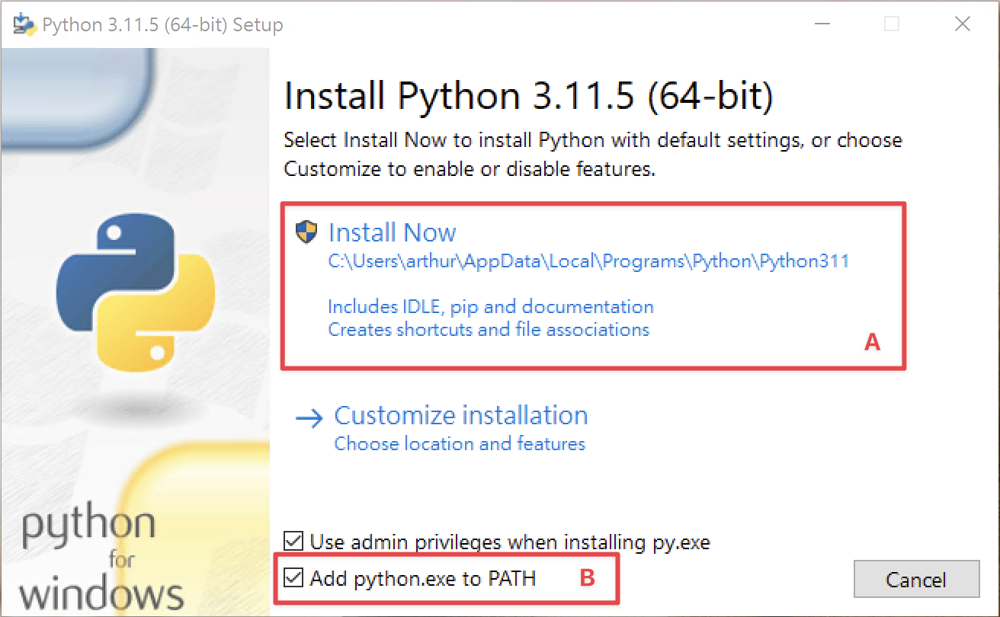

# Day01 - 源由 & 環境設定

## 前言

嗨嗨大家好，我是拉布。

這是一個有關於 [Django REST framework](https://www.django-rest-framework.org) （後面我會簡稱他為 `DRF`）的文章，在這三十天裡面我會一步一步的帶領大家一起學習有關 DRF 的相關知識以及用法。

在開始之前先簡單說一下為什麼要寫這系列的文章好了。主要是發現比較少有一系列從 0 開始學 Django API 開發的文章，大多都是教 Template 的開發方式，反而 API 的部分大多都被淺淺的帶過，但其實在後端開發的過程中 API 佔有很重要的角色，理解 DRF 的原理以及使用方式會讓開發的過程更加的輕鬆以及得心應手。

所以在往下之前我會期待大家對於以下的知識有一些些了解：

1. Python 基礎
2. 什麼是 API
3. 什麼是 RESTful

如果沒有也不用緊張，可以快速的 Google 一下，或是讓 ChatGPT 解釋給你聽，再回頭來看這系列的文章唷。

## 環境安裝

在這系列文章我的範例都會使用 Python 3.11 進行，如果你的版本較低也不用緊張，在使用到新的語法時我會提醒大家。但是一定要確定你的版本至少大於 3.8 因為我們使用的 Django 4.2 版[最低只支援](https://docs.djangoproject.com/en/4.2/faq/install/#what-python-version-can-i-use-with-django)到 3.8 版的 Python。

如果你尚未安裝 Python 那就讓我們一起把他安裝起來吧！

### Windows

如果是 Windows 的人，可以到 Python 的[官方網站](https://python.org) 去下載安裝檔。

唯一要注意的地方是在安裝的過程中看到 `Add python.exe to PATH`（下圖 B）選項時要先將他勾選起來，才能按下 `Install Now`（下圖 A）唷！



### Mac / Linux

如果是 Mac 或是 Linux 的同學其實系統中已經內建好 Python3 了，可以打開終端機輸入 `python3 -V` 來確認當前的版本。

不過我會推薦使用 [pyenv](https://github.com/pyenv/pyenv) 這個工具來進行 Python 的安裝，他可以在系統中同時安裝並管理多個 Python 版本。

安裝 pyenv 的方法也相當簡單可以直接使用官方提供的 [installer](https://github.com/pyenv/pyenv-installer#install) 執行完對安裝指令後接著依照[官方文件](https://github.com/pyenv/pyenv#set-up-your-shell-environment-for-pyenv) 設定好相關的環境變數就好了。如果不確定自己在使用哪個 shell 的話，可以透過 `echo $SHELL` 指令確認。

安裝完 pyenv 後接著我們就來安裝 Python 吧

```bash
pyenv install 3.11.5  # 下載並安裝 Python 3.11.5 版
pyenv global 3.11.5  # 將 Python 預設的版本設定為 3.11.5 版
```

### 安裝結果確認

在終端機（Windows 的 `命令提示字元`）輸入 `python -V` 看到剛剛安裝的版本號就代表你成功了！

## 總結

以上就是今天的內容了，我們今天將 Python 安裝好了，明天開始我們就要開始進入 Django 以及 DRF 的奇妙世界啦！
