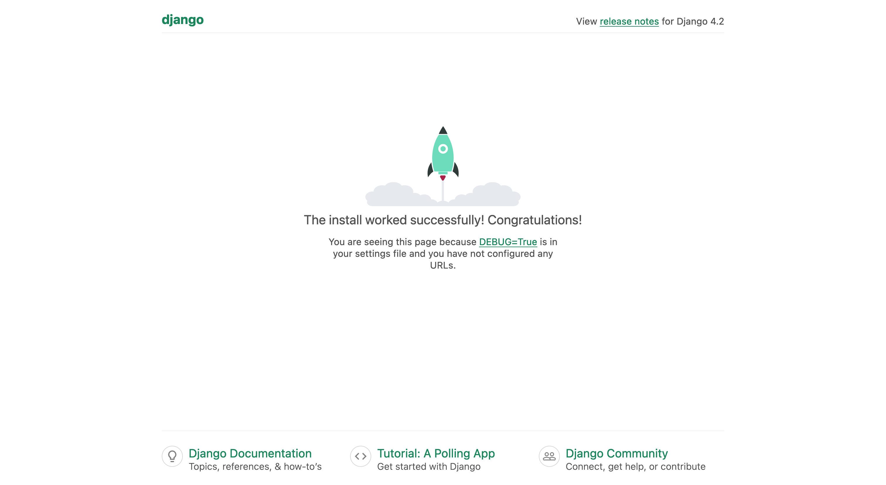

# Day02 - 專案建立

## 前言

太好了昨天我們已經將 Python 的環境建立好了，接下來我們可以開始建立 Django 的專案了。Django 是一個基於 Python 的網頁框架，他提供了很多很方便的功能讓我們加速網頁的開發。

首先我們得把 Django 安裝起來，這系列的文章我們會使用 poetry 當作套件和虛擬環境的管理，如果你有自己偏好的也可以使用自己喜歡的。但如果沒有那我們一起使用 poetry 吧！

## Poetry 的安裝

我們可以參考官方文件的[安裝教學](https://python-poetry.org/docs/#installation)

### Windows

在 powershell 貼上下方指令後就可以了

```powershell
(Invoke-WebRequest -Uri https://install.python-poetry.org -UseBasicParsing).Content | python3 -
```

可以透過下方指令確認是否安裝成功

```powershell
poetry --version
```

如果找不到可以試試登出再登入，如果依然不行確認一下 `%APPDATA%\Python\Scripts` 是否有在 PATH 環境變數裡面。

### Mac / Linux

在終端機貼上下方指令

```bash
curl -sSL https://install.python-poetry.org | python3 -
```

可以透過下方指令確認是否安裝成功

```bash
poetry --version
```

如果出現指令不存在的，將路徑 `$HOME/.local/bin` 加入 PATH 環境變數中（可以透過修改 `.bashrc` 或 `.zshrc` 來加入），加入完成後透過指令

```bash
exec $SHELL
```

來重新載入 shell 的設定檔，應該就可以找到 poetry 了唷！

## 使用 Poetry 初始化專案

首先我們先建立一個資料夾，並進入資料夾內

```bash
mkdir drf-playground
cd drf-playground
```

接著因為我們要透過 poetry 管理我們的環境，所以需要先初始化一下

```shell
poetry init
```

他會詢問你一些問題基本上就先用預設選項（enter 一直按）就好了，我們後面會慢慢調整他。下方是我建立的時候終端機輸出結果

```plaintext
This command will guide you through creating your pyproject.toml config.

Package name [drf-playground]:
Version [0.1.0]:
Description []:
Author [None, n to skip]:  Arthur Chang <arthurc0102@gmail.com>
License []:
Compatible Python versions [^3.11]:

Would you like to define your main dependencies interactively? (yes/no) [yes]
You can specify a package in the following forms:
  - A single name (requests): this will search for matches on PyPI
  - A name and a constraint (requests@^2.23.0)
  - A git url (git+https://github.com/python-poetry/poetry.git)
  - A git url with a revision (git+https://github.com/python-poetry/poetry.git#develop)
  - A file path (../my-package/my-package.whl)
  - A directory (../my-package/)
  - A url (https://example.com/packages/my-package-0.1.0.tar.gz)

Package to add or search for (leave blank to skip):

Would you like to define your development dependencies interactively? (yes/no) [yes]
Package to add or search for (leave blank to skip):

Generated file

[tool.poetry]
name = "drf-playground"
version = "0.1.0"
description = ""
authors = ["Example"]
readme = "README.md"

[tool.poetry.dependencies]
python = "^3.11"


[build-system]
requires = ["poetry-core"]
build-backend = "poetry.core.masonry.api"


Do you confirm generation? (yes/no) [yes]
```

都完成後你會發現目錄下多出了一個 `pyproject.toml` 大概會長得像是下方這樣。每個人產生出來的可能會有一些些的不同，可能是作者名字或是其他欄位，這方面沒什麼關係只要大致上結構是相同的就好了

```toml
[tool.poetry]
name = "drf-playground"
version = "0.1.0"
description = ""
authors = ["Arthur Chang <arthurc0102@gmail.com>"]
readme = "README.md"

[tool.poetry.dependencies]
python = "^3.11"


[build-system]
requires = ["poetry-core"]
build-backend = "poetry.core.masonry.api"
```

## 安裝 Django

根據前面的步驟我們已經將現在的資料夾交給 poetry 管理了，現在我要透過 poetry 安裝 Django 這個套件

```bash
poetry add django
```

輸出結果如下

```plaintext
Using version ^4.2.5 for django

Updating dependencies
Resolving dependencies... (0.3s)

Package operations: 3 installs, 0 updates, 0 removals

  • Installing asgiref (3.7.2)
  • Installing sqlparse (0.4.4)
  • Installing django (4.2.5)

Writing lock file
```

這時候你會發現你的專案下多了一個檔案 `poetry.lock` 這是 poetry 拿來紀錄當前專案所有依賴套件的檔案，裡面內容很多看起來很可怕，沒事不要點開來看也不要改他，把這麻煩的事情放心交給 poetry 就好了。

我們只需要輸入下方指令

```bash
poetry shell
```

就能啟動 poetry 幫我們建立好的虛擬環境了！要注意一下 Django 是被安裝在這個虛擬環境中，如果重開終端機的話要輸入這個指令啟動虛擬環境後才有辦法使用下方會提到的 Django 指令唷。

## 建立 Django 專案

我們已經成功的將 Django 給安裝好了，我們先確認一下 Django 的版本

```bash
django-admin --version
```

如果安裝都成功你應該會看到 Django 的版本號，這系列文章使用的是 `4.2.5` 版本。

現在我要使用它來把整個專案的基礎目錄建立起來，透過下方指令建立一個新的專案（要注意 server 單字後方有一個 `點` 唷）

```bash
django-admin startproject server .
```

輸入完成後你會發現你的目錄下目前有這些檔案

```plaintext
├── manage.py
├── poetry.lock
├── pyproject.toml
└── server
    ├── __init__.py
    ├── asgi.py
    ├── settings.py
    ├── urls.py
    └── wsgi.py
```

這時候我們輸入

```python
python manage.py runserver
```

接著我們打開瀏覽器輸入 <http://127.0.0.1:8000> 後應該可以看到下方圖片的畫面



就代表你成功建立一個 Django 專案並將他跑起來啦！

## 總結

今天我們安裝了 poetry 來管理我們的專案套件以及虛擬環境，並將 Django 框架安裝好，專案也建立好並成功啟動了。今天先做到這邊，明天我們繼續將其他該設定的東西都設定設定好，之後就要開始寫程式啦！
