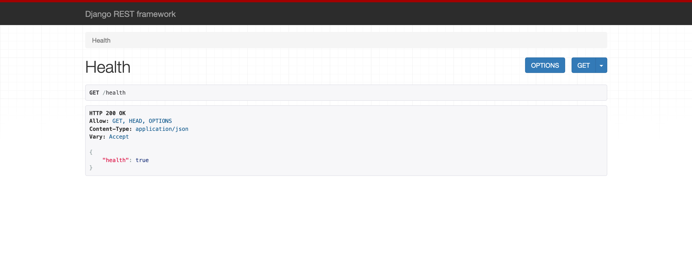
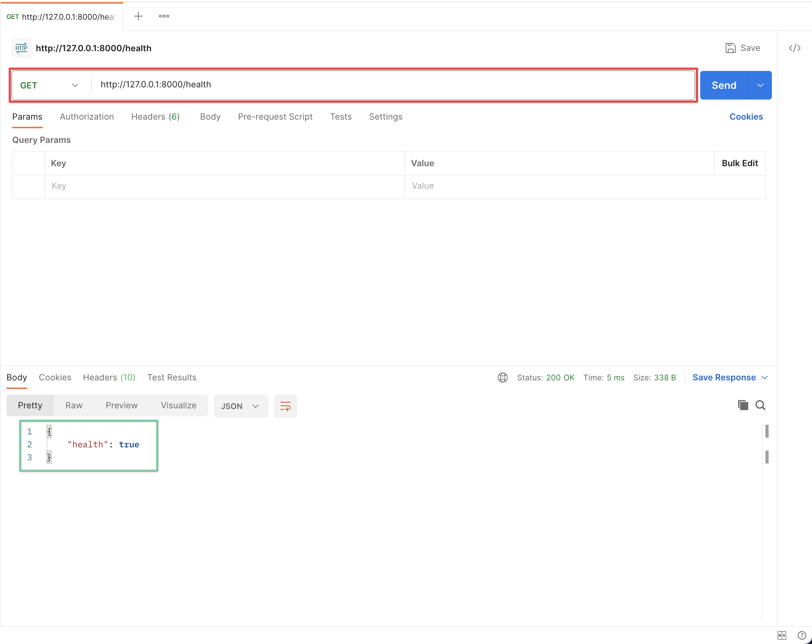

# Day04 - 初探 DRF

## 前言

昨天我們已經將專案與周邊的工具都設定好了，現在我們來撰寫第一個 API 吧！

## DRF 安裝

### 什麼是 DRF 為什麼我要使用他？

再開始安裝之前我們先來說一下什麼是 DRF 跟為什麼我們要使用他。DRF 就是 Django REST framework 的簡稱，他是一個基於 Django 的 API 擴充。

前面我們安裝的是 Django 他是一個 Python 的網頁框架，他包含了很多開發網頁會需要使用到的東西，例如 ORM 或是驗證系統等等（我們後續的文章會介紹到），他可以避免我們重複的造輪子，但他並沒有提供開發 API 所需要的功能，所以我們需要 DRF 他整合了前面提到 Django 的那些功能來協助我們快速的開發 API。

所以透過 DRF 的擴充他讓我們可以在使用 Django 方便功能的同時也有方便的工具可以開發 API。

### 安裝 DRF 並設定

了解了 DRF 的用途後我們來安裝他吧！

```bash
poetry add djangorestframework
```

安裝後可以看到這個輸出，就代表安裝成功了

```plaintext
Using version ^3.14.0 for djangorestframework

Updating dependencies
Resolving dependencies... (0.1s)

Package operations: 2 installs, 0 updates, 0 removals

  • Installing pytz (2023.3.post1)
  • Installing djangorestframework (3.14.0)

Writing lock file
```

接著我需要告訴 Django 我們有安裝這個套件，我們開啟 `server/settings.py` 找到 `INSTALLED_APPS` 這個設定，並把 `rest_framework` 加入到裡面

```diff
# ...... 以上省略 ......

INSTALLED_APPS = [
    "django.contrib.admin",
    "django.contrib.auth",
    "django.contrib.contenttypes",
    "django.contrib.sessions",
    "django.contrib.messages",
    "django.contrib.staticfiles",
+   "rest_framework",
]

# ...... 以下省略 ......
```

這樣我們就安裝好了。

## 第一個 API

接下來我們要開始寫第一個 API 了，但我們先先建立一個 APP 讓我們寫 API。

### 建立第一個 APP

在 Django 的專案中會將功能放在不同的 APP 裡面，這樣可以方便區分功能且多人協作的時候也會比較方便，甚至可以將 APP 放到其他專案中重複使用。我們也可以從網路上下載其他人寫好的 APP 來用。

那為了方便管理我們會將所有 APP 都放在 `server/app` 這個資料夾中，不過他現在還不存在所以我們來建立一下，同時我們也要在 `server/app` 資料夾底下建立一個檔案 `__init__.py` 讓他變成一個 Python 的 module。

```diff
# server 資料夾底下的結構

└── server
    ├── __init__.py
+   ├── app
+   │   └── __init__.py
    ├── asgi.py
    ├── settings.py
    ├── urls.py
    └── wsgi.py
```

接著我們使用下方的指令建立 APP

```bash
cd server/app  # 因為 APP 要建立在 server/app 資料夾中，所以先透過 cd 切換目錄
django-admin startapp common  # 建立一個 APP 名稱為 common
cd ../..  # 回到原本的目錄
```

現在你可以看到 `server/app` 資料夾底下已經出現我們建立好的 APP

```diff
# server 資料夾底下的結構

└── server
    ├── __init__.py
    ├── app
    │   ├── __init__.py
+   │   └── common
+   │       ├── __init__.py
+   │       ├── admin.py
+   │       ├── apps.py
+   │       ├── migrations
+   │       │   └── __init__.py
+   │       ├── models.py
+   │       ├── tests.py
+   │       └── views.py
    ├── asgi.py
    ├── settings.py
    ├── urls.py
    └── wsgi.py
```

裡面有很多檔案，我們後面會慢慢使用它，當後面用到的時候再來解釋它個功能。

### 建立第一個 View

接著我們要來寫第一個 View 了，那什麼是 view 呢？他在 Django 裡面是負責放處理商業邏輯的地方（可能是自己處理或呼叫其他 services），如果你曾經寫過其他框架他的角色非常類似於傳統 MVC 架構中的 controller，不過在 Django 的世界中使用的是 MTV（Model, Template and View）架構，Model 負責處理資料庫相關的東西，Template 負責處理畫面（在這系列文章不會用到，因為我們寫的是 API）而 View 處理的就是商業邏輯。

我們打開 `server/app/common/views.py` 並檔案的內容刪除

```diff
-from django.shortcuts import render
-
-# Create your views here.
```

接著貼上下方的程式碼

```python
from rest_framework import response, views


class HealthView(views.APIView):
    def get(self, request):
        return response.Response({"health": True})
```

讓我們看看這段程式，我們做了幾件事情

- 定義了一個名為 HealthView 他繼承了 DRF 提供的 APIView，這樣我們可以很簡單的建立一個 API。
- 我們在 HealthView 裡面定義了一個名為 `get` 的方法，當使用者使用 HTTP GET 方法請求這個 view 時這個方法會被呼叫。
- HealthView 的 get 方法回傳了一個 Response，這是等等我們請求這個 view 時會看到的回應。

### 設定 URL

到目前為止我們已經將我們的 view 寫好了，接下來只要設定好 url（網址）就可以看到結果了。

讓我們打開 `server/urls.py` 並修改它

```diff
# ...... 以上省略 ......

from django.contrib import admin
from django.urls import path
+
+from server.app.common import views as common_views
+
urlpatterns = [
    path("admin/", admin.site.urls),
+   path("health", common_views.HealthView.as_view()),
]
```

我們在上方的程式碼先把我們定義好的 view import 到 urls.py 這個檔案中，接著告訴 Django 說當使用者訪問 `/health`（註冊時開頭的 `/` 會省略）這個網址時執行我們的 HealthView。

### 驗證

接著我們來看看效果，先打開終端機來啟動 Server（別忘了先啟動虛擬環境唷）

```bash
python manage.py runserver
```

然後在瀏覽器打開 <http://127.0.0.1:8000/health>，應該就能看到結果了



從圖片可以看到我們剛剛設定的 Response 內容已經顯示出來的。

但這時候可能會有些疑問，我們不是寫 API 嗎？怎麼看起來像是一班的網頁呢？那是因為 DRF 很貼心，當他發現你使用瀏覽器訪問時，會自動變成漂亮個網頁畫面。但當我們使用其他工具呼叫時就會回傳一般的 JSON。

一般來說我們測試 API 時會使用 [Postman](https://www.postman.com/) 這個工具（當然還有其他的，大家有習慣的可以自由選擇）

我們可以將它安裝好，安裝好後我們在裡面的網址列（下圖紅框）輸入 <http://127.0.0.1:8000/health> 在按下 Send（藍色按鈕）就可以看到 JSON 的結果（下圖綠框）了。



## 今天結束之前

今天的開發到目前告一個段落，但別忘了我們需要利用一下前一天設定好的輔助工具檢查一下我們今天的程式是否有問題，並自動排版一下

首先利用 ruff 檢查一下程式

```bash
ruff check --fix .
```

會看到結果說有找到三個錯誤但 ruff 幫我們修掉了（是 models.py, admin.py 以及 test.py 在產生時有沒用到的東西被 import 了）所以我們不用處理。

再來我們用 black 來排版一下程式

```bash
black .
```

可以看到剛剛那三個檔案被重新排版過了，但一樣 black 幫我們排版了所以不用做額外的處理。

最後我們用 pyright 來做一下型態檢查

```bash
pyright .
```

會看到下方的輸出發現有問題出現了

```plaintext
/path/to/project/server/app/common/apps.py
  /path/to/project/server/app/common/apps.py:5:26 - error: Expression of type "Literal['django.db.models.BigAutoField']" cannot be assigned to declared type "cached_property"
    "Literal['django.db.models.BigAutoField']" is incompatible with "cached_property" (reportGeneralTypeIssues)
1 error, 0 warnings, 0 informations
```

會出現這個問題的原因是因為 pyright 不知道 Django 這個套件的型態，所以我們需要安裝 [django-types](https://github.com/sbdchd/django-types) 他記錄了 Django 裡面所有程式的型態，這樣 pyright 才能正確的判斷。那因為預設也不知道 DRF 的型態（雖然還沒有任何錯誤產生）所以我們也要一起安裝 [djangorestframework-types](https://github.com/sbdchd/djangorestframework-types)。

```bash
poetry add --group lint django-types djangorestframework-types
```

接著我們再重新跑一次 pyright 指令

```bash
pyright .
```

就會看到下方輸出，沒有任何錯誤了

```plaintext
0 errors, 0 warnings, 0 informations
```

到這邊我們就確保了我們今天寫的程式都符合之前設定好的規則了。

## 總結

今天我們安裝了 DRF 並寫了第一個簡單的 API 也用了昨天設定好的工具確認我今天寫的程式都符合規則，明天開始我們會繼續介紹 DRF 的其他功能。
