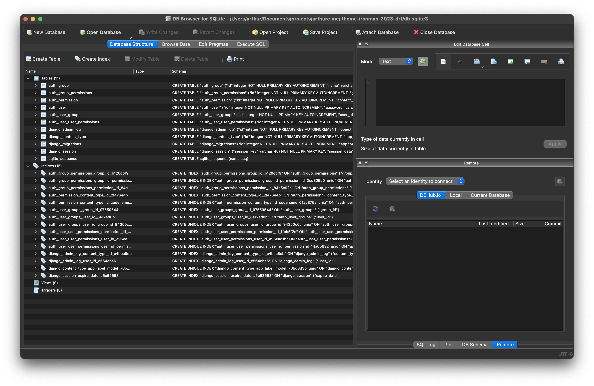
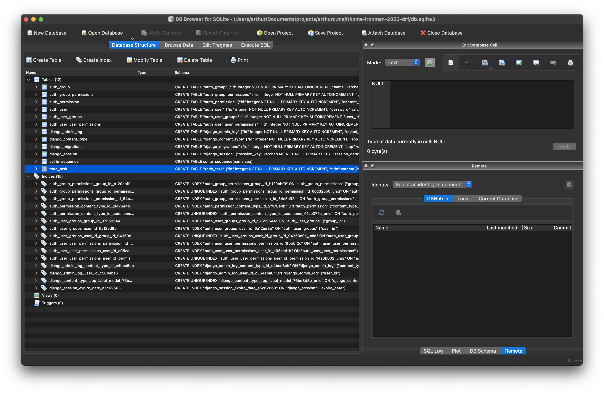

# Day05 - 所以我說那個資料呢？

## 前言

昨天我們已經寫了第一個 API 了，但他只做了一件事情就是回傳一個 `health` 的 key 表達 API 很健康，但實際上我們應該要從資料庫裡面拿資料才對，今天讓我們來把資料庫建立起來吧。

## 建立第一個 Model

我們來做一個萬年的練習題 TODO List 好了，昨天我們建立了一個名字是 common 的 APP 今天我們來建立一個叫做 todo 的吧。不放在 common 的原因是因為前面有提到我們會依照功能的分類把他放在不同的 APP 裡面，所以把 todo 的東西放在 common 裡面是不太合適的。

### 建立 todo APP

讓我們來建立 APP 吧，一樣要記得啟動虛擬環境唷。

```bash
cd server/app  # 因為 APP 要建立在 server/app 資料夾中，所以先透過 cd 切換目錄
django-admin startapp todo  # 建立一個 APP 名稱為 todo
cd ../..  # 回到原本的目錄
```

完成後就會看到目錄下多了這些檔案

```diff
# server 資料夾底下的結構

└── server
    ├── __init__.py
    ├── app
    │   ├── __init__.py
    │   ├── common
    │   │   ├── __init__.py
    │   │   ├── admin.py
    │   │   ├── apps.py
    │   │   ├── migrations
    │   │   │   └── __init__.py
    │   │   ├── models.py
    │   │   ├── tests.py
    │   │   └── views.py
+   │   └── todo
+   │       ├── __init__.py
+   │       ├── admin.py
+   │       ├── apps.py
+   │       ├── migrations
+   │       │   └── __init__.py
+   │       ├── models.py
+   │       ├── tests.py
+   │       └── views.py
    ├── asgi.py
    ├── settings.py
    ├── urls.py
    └── wsgi.py
```

### 建立 Model

昨天我們有提到 Django 是使用 MTV 架構，而 T 我們這次不太會使用到 V 昨天我們用過了，今天讓我們來用 M 吧

讓我們打開 `server/app/todo/models.py` 這個檔案，接著用下方的程式碼覆蓋掉檔案現有的全部內容。

```python
from django.db import models


class Task(models.Model):
    title = models.CharField(max_length=255)
    description = models.TextField(blank=True)

    def __str__(self):
        return self.title
```

上方的程式碼做了這些事情

- 我們定義了一個名為 Task 的 Class，他繼承了 Model
- 我們在 Task 裡面定義了兩個屬性分別為 title 以及 description 分別代表了 todo 任務的標題以及說明
  - title 屬性為 CharField 最大長度為 255
  - description 屬性為 TextField 允許 blank（空白）代表這個欄位是選填的
- 還定義了一個 `__str__` 方法，他回傳 title 這個屬性

看到這邊相信大家還是一頭霧水，我定義了這個 Class 到底代表什麼意思，還有那一堆奇怪的定義又是什麼？別緊張讓我們一步一步的把問題釐清

為什麼要定義這個 Class 呢？那是因為我們想用 ORM 去操作資料庫，所謂的 ORM 是 Object Relational Mapping 的縮寫，他讓我們用程式語言（現在我們使用的是 Python）的語法去操作與定義資料庫。在沒有 ORM 的情況下我們會需要 SQL 去操作資料並且定義我們所需要的資料表，有了 ORM 後我們就可以像上面的語法一樣透過繼承 Model 的 Class 來定義一張資料表，而裡面的屬性代表的就是資料表中的欄位。

所以根據上方的程式碼我們定義了一個名為 Task 的資料表，而裡面有兩個來為分別是 title 與 description，那兩個欄位的類型分別為 CharField 與 TextField，而我們後面寫的 max_length 與 blank 等等的代表的是去設定那個欄位有什麼限制。

那 CharField 與 TextField 感覺都是文字型態又有什麼不同？在 Django 中 CharField 會轉換成資料庫的 `varchar` 這個型態而 TextField 會轉換成 `text` 這個型態（如果有興趣探討深入不同的人可以查一下，這邊我們把重點放在 Django 上就不深入展開討論），這兩者在 Django 中最大的差別在於 TextField 可以不給最大長度，但 CharField 一定要設定 max_length 這個限制。還有如果用 TextField 在 Django Admin（後面會介紹的功能）中使用 TextField 會是可以輸入多行的字串，而 CharField 只有單行大家可以視需求選用。

那 `__str__` 又是什麼呢？`__str__` 這個方法是 Python 要將物件轉換成字串型態時會呼叫的方法，我們會在後面看到他的效果，這邊我們設定的就是告訴 Python 說當這個物件要被轉換成字串時要顯示 title 這個欄位。

## 建立資料庫

以上我們就定義好了一張表了，但目前我們還讓表停留在 Python 中，還沒有轉換成真正的資料庫，讓我們先把資料庫建立起來吧！

```bash
python manage.py migrate
```

在終端機輸入上方的指令後會看到目錄中出現 `db.sqlite3` 這個檔案，這個就是 Django 預設使用的資料庫（他不會被用在正式環境，單純是開發用的），讓我們用資料庫工具把它打開來看看吧！這邊我們會使用 [DB Browser for SQLite](https://sqlitebrowser.org/) 來打資料庫打開。

安裝好後將程式打開找到 `Open Database` 這個按鈕並找到 `db.sqlite3` 這個檔案把他打開就會看到像下面這張圖的樣子了



裡面可以看到我們目前資料庫所有的表，這時候你可能會想說奇怪我們剛剛只定義了一張表為什麼這邊卻跑出了一堆呢？是因為 Django 內建有權限系統等等的功能，他有一些預設的表這些就是他預設的表，我們後面用到的時候再來介紹他們。

但各位應該能發現目前出現的表中並沒有我們剛剛建立的 Task 表，這是正常的因為我們目前還少了一些步驟

首先我們先打開 `server/settings.py` 這個檔案並修改他

```diff
# ...... 以上省略 ......

INSTALLED_APPS = [
    "django.contrib.admin",
    "django.contrib.auth",
    "django.contrib.contenttypes",
    "django.contrib.sessions",
    "django.contrib.messages",
    "django.contrib.staticfiles",
    "rest_framework",
+   "server.app.common",
+   "server.app.todo",
]

# ...... 以下省略 ......
```

這邊是因為我們需要通知 Django 說我們有這個 APP 這樣他才會自動地去尋找這個 APP 中的 Model，等等要建立的時候才會找到他。那昨天我們建立的 common APP 我們並沒有加入是因為我們沒有定義 Model 所以其實看不出差異，但實際上應該是要加的，所以我們這次一並將他補上。

再打開 `server/app/todo/apps.py` 並修改他，`apps.py` 是紀錄當前 APP 的資訊以及設定的檔案。

```diff
from django.apps import AppConfig


class TodoConfig(AppConfig):
    default_auto_field = "django.db.models.BigAutoField"
-   name = "todo"
+   name = "server.app.todo"
```

這邊我們是要修改這個 APP 的名字，大家如果有看過其他的教學可能會發現會將 APP 直接放在最外層的目錄，但在這篇教學中我教大家放在 `server/app` 這個資料夾底下，因為實際上在開發的時候其實我們很少將 APP 全部放在最外層，這樣會讓整個專案很亂，所以在這邊我也希望保持平常開發的習慣放在 `server/app` 中。但因為我們並不是放在最外層的目錄，所以我們需要將 APP 的 name 修改成完整的路徑，這樣 Django 才能正確的使用他。

所以別忘了我們的 `common` 這個 APP 因為也不是放在最外層的關係所以 `server/app/common/apps.py` 也需要一起加上去唷

```diff
from django.apps import AppConfig


class CommonConfig(AppConfig):
    default_auto_field = "django.db.models.BigAutoField"
-   name = "common"
+   name = "server.app.common"
```

以上我們就 APP 設定好了，我們可以通知 Django 來建立我們的資料表了。

```bash
python manage.py makemigrations
python manage.py migrate
```

以上我們就建立好表了，我們可以打開我們的 DB 工具看一下，應該就會看到一張名為 `todo_task` 的表了（如果沒有可以按 `Close Database` 再重新按 `Open Database` 重新開啟）



## 總結

今天先暫時到這邊，不然一次吸收太多資訊的話會很累的。結束前別忘了檢查一下今天的程式碼有沒有問題，並排版好喔。

```bash
ruff check --fix .
black .
pyright .
```

今天我們先把表建出來了，明天我會解釋建資料表的那兩個指令到底做了什麼。更後面我就會教大家怎麼把資料存進去並使用 DRF 來做 API 顯示資料庫中的資料了～
