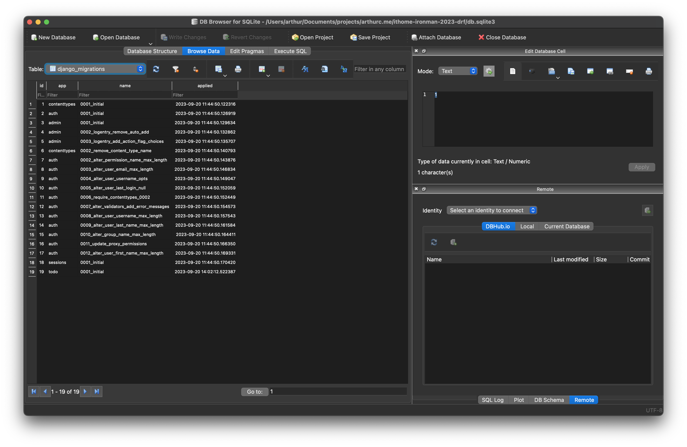
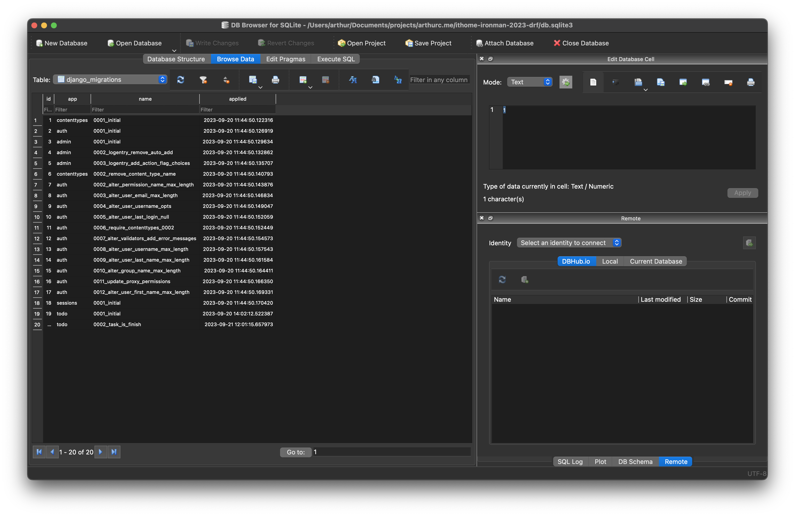
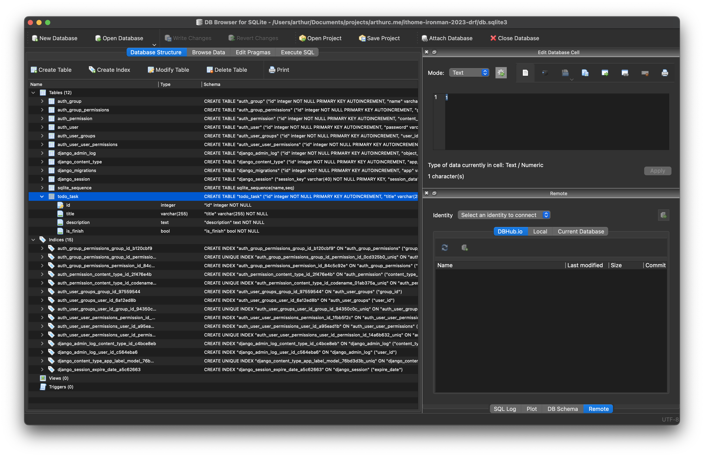

# Day06 - 資料庫 Migrate & Migration

## 前言

昨天我們將 Model 定義好後下了兩個指令就將資料表建立出來的，但背後 Django 到底幫我們做了什麼？

昨天的做後我們最後下了兩個指令分別是 `python manage.py makemigrations` 和 `python manage migrate` 讓我們一個指令一個指令的來看看吧。

## 什麼是 makemigrations 呢？

在 Django 中 makemigrations 指令協助我們建立資料庫的遷移檔案，遷移檔就是當你修改 Model 的時候他會去紀錄這次修改的 Model 跟上一個版本有什麼不同。那我們需要遷移檔去管理資料庫而不是直接使用 Model 的結構直接建立到資料庫中是因為以下幾個原因：

- 當我們建立或是修改資料表時他可以針對有修改調整的地方去做調整就好了，不用整個表都跑過一次這樣會比較快。
- 我們想像一下如果我們今天在修改一個系統，完成一個功能上線後，突然發現出現一個很嚴重的 bug 你希望退回前一個版本，我們就可以透過遷移檔指定我們希望將資料庫退回特定的版本。

那說了半天遷移檔到底在哪呢？

遷移檔案會在 app 的 migrations 裡面，例如我們昨天建立的 Task 資料表，他的遷移檔就是在 `server/app/todo/migrations` 裡面，讓我們一起看看裡面的內容。

對了這邊說一下，帶大家看裡面的內容是希望大家了解裡面做了哪些事情，但在大多數的情況下我們都不會編輯遷移檔，就讓 makemigrations 指令去工作就好了，至於是什麼狀況我們會需要修改遷移檔呢？我們後面會說到。

讓我們看看 `server/app/todo/migrations/0001_initial.py` 吧！

```python
# Generated by Django 4.2.5 on 2023-09-20 14:01

from django.db import migrations, models


class Migration(migrations.Migration):
    initial = True

    dependencies = []

    operations = [
        migrations.CreateModel(
            name="Task",
            fields=[
                (
                    "id",
                    models.BigAutoField(
                        auto_created=True,
                        primary_key=True,
                        serialize=False,
                        verbose_name="ID",
                    ),
                ),
                ("title", models.CharField(max_length=255)),
                ("description", models.TextField(blank=True)),
            ],
        ),
    ]
```

檔案的行數有點多，我們看 `operations` 那的部分就好了，可以看到他裡面放的就是當這個遷移檔被套用到資料庫的時候要做的動作。我們可以發現他有一個 `CreateModel` 然後定義了 Model 的名稱以及欄位，大家可以發現我們在定義 Task 這個 Model 的時候明明只有定義了兩個欄位但為什麼這邊跑出了三個呢？

是因為我們定義的這張表缺少了一個主鍵（primary key）他是唯一識別資料的一個值，每張表都需要有一個且不能重複（這邊屬於資料庫的範圍我們就不展開來說了，大家有興趣可以查一下資料庫相關，我們先記得每張表都需要有一個主鍵且他不能重複就好了），所以 Django 在發現你的 Model 中缺少主鍵時他就會貼心地幫你產生一個，因為這個原因所以我們才會在這邊看到 id 這個欄位。

現在我們試試看修改一下 Task 這個 Model 我們來幫他加一個叫做 `is_finish` 的欄位來記錄這個任務是否完成了，讓我們打開 `server/app/todo/models.py` 並依照下方的方式修改檔案

```diff
from django.db import models


class Task(models.Model):
    title = models.CharField(max_length=255)
    description = models.TextField(blank=True)
+   is_finish = models.BooleanField(default=False)

    def __str__(self):
        return self.title
```

我們在這邊定義了一個欄位叫做 is_finish 同時設定他的型態是一個布林，然後預設值是 False（如果想知道有哪些資料欄位可以用可以參考這個[文件](https://docs.djangoproject.com/en/4.2/ref/models/fields/#field-types)）

接著我們來通知 Django 我們有修改 Model 讓他建立新的遷移檔吧！（別忘了操作下方指令前要啟動虛擬環境唷）

```bash
python manage.py makemigrations
```

指令下完後我們可以看到 `server/app/todo/migrations` 的資料夾裡面出現了 `0002_task_is_finish.py` 這個檔案，讓我們一起看看他的內容吧！

```python
# Generated by Django 4.2.5 on 2023-09-21 11:47

from django.db import migrations, models


class Migration(migrations.Migration):
    dependencies = [
        ("todo", "0001_initial"),
    ]

    operations = [
        migrations.AddField(
            model_name="task",
            name="is_finish",
            field=models.BooleanField(default=False),
        ),
    ]
```

可以看到檔案裡面的 `dependencies` 說了這個遷移檔依賴 todo APP 的 0001_initial 遷移檔（就是我們剛剛看的那個），代表說再套用現在這個 0002_task_is_finish 的遷移檔前 0001_initial 必須先配套用，因為 task 的表要先被建立出來我們才能加欄位。

接著我們可以看到 `operations` 的部分，這次就跟剛剛不一樣了，這次裡面放的是一個 `AddField` 表示我們要建立一個欄位，同時也指定了是在哪個 Model 建立哪個欄位。

以上這就是 Django 管理我們資料庫版本的方式，現在讓我們打開昨天安裝的資料庫工具看看 task 那張表的欄位


到這邊大家應該會有兩個問題

1. 為什麼表的名稱感覺跟我們定義的有一些些不同？
2. 為什麼剛剛的 is_finish 欄位沒有出現？

首先第一個問題，是因為 Django 預設在幫我們建立表的時候會將表名取為 `<app>_<model>` 而不是直接拿 model 名稱來用，這樣我們在其他 APP 如果剛好有同一個名稱的 Model 時就不會衝突了。

第二個問題是因為我們目前只說明了昨天下的兩個指令中的其中一個，讓我們看看昨天的第二指令吧！

## 什麼是 migrate 呢？

在 Django 中 migrate 這個指令是告訴 Django 將我們目前還沒有套用到資料庫中的遷移檔套用到資料庫中。那 Django 是怎麼知道哪些有被套用過哪些又沒有呢？讓我們一起看看 `django_migrations` 這張表的資料內容



我們可以看到目前 todo 這個 APP 只套用了 0001 這個遷移檔案（第 19 筆資料），我們剛剛建立的 0002 還沒有被套用上去，所以 is_finish 欄位還沒出現，讓我們來套用他吧

```bash
python manage.py migrate
```

接著我們回到資料庫工具中看一下 `django_migrations` 那張表的資料，會看到出現了 todo 的 0002 遷移檔已經被套用的資訊（如果沒有按一下工具中的重新整理）



接著讓我們看看 `todo_task` 那張資料表，應該會發現 is_finish 欄位已經出現了



以上就是 migrate 指令的效果。

這時候大家心裡可能會有疑問，剛剛在說遷移檔的好處時提到可以退回上一個版本，那我要怎麼退回上一個版本呢？

```bash
python manage.py migrate todo 0001
```

用上方這個指令就可以告訴 Django 說我們要調整 todo 這個 APP 的遷移檔案版本到 0001，現在大家可以回資料庫管理工具看看應該會發現 `django_migrations` 資料表中的 todo 0002 那筆資料不見了，同時資料表中的 is_finish 欄位也不見了。

那看完後別忘了重新下，讓資料庫回到最新的狀態唷（下方這個指令因為沒有指定 APP 與版本，預設的行為是所有 APP 都套用最新版本的意思）

```bash
python manage.py migrate
```

現在可以看看資料庫中 is_finish 欄位應該又出現了。

## 總結

那今天就先到這邊吧，今天我們學會了什麼是遷移檔，也學會了怎麼透過 Django 管理了我們的資料庫。

雖然今天沒改什麼檔案，但結束前別忘了檢查一下今天的程式碼有沒有問題，並排版好喔。

```bash
ruff check --fix .
black .
pyright .
```

明天我們就會開始寫 API 來做資料的寫入跟呈現了，一起期待一下吧～
