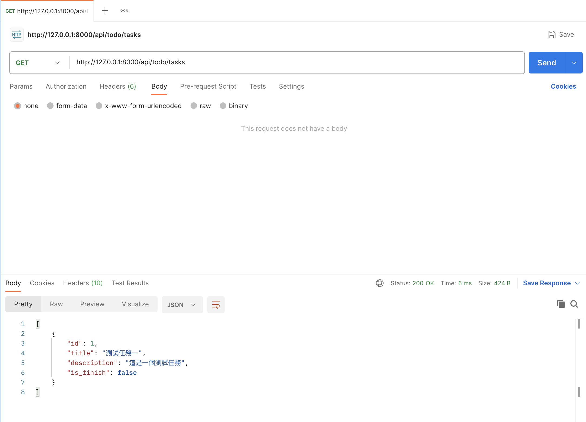

# Day07 - 用 DRF 修改資料庫

## 前言

昨天我們學習了 makemigrations 與 migrate 這兩個指令，了解了 Django 如何管理我們的資料庫，今天我們要來使用 DRF 來寫 API 操作資料庫，讓我們開始吧！

## 建立 Serializer

在建立 View 之前我們需要先建立 serializer（序列化），他會協助我們過濾使用者傳進來的資料，並進行資料的驗證。大家可以能會想說為什麼我們需要序列化呢？我們有 Model 直接把使用者傳入的東西用來建立 Model 就好了，我們在定義 Model 時也有設定長度或是型態等等的，應該可以吧？

其實這樣是不行的，且非常危險，後續在開發 API 的時候大家要記得千萬不能做這樣的事情。大家想像一下假設你有一個 User 的 Model 用來存放使用者資料，裡面有幾個欄位分別是：

- 帳號
- 密碼
- 姓名
- 是否為超級使用者

當我們做了一個 API 要讓使用者修改自己的資料時，應該只能讓他修改帳號或是姓名還有密碼，不能讓他調整超級使用者狀態。但如果我們直接將使用者傳入的東西放到 Model 中進行驗證還有建立或修改資料，就有可能被使用者猜到是否為超級使用者的欄位名稱，進而讓他有機會修改狀態。要解決這個問題我們就必須在把資料放入 Model 前先進行欄位的過濾只保留可以修改的欄位，而 Serializer 的功能就是協助我們做過濾以及驗證，只要資料可以順利通過序列化的驗證我們就能放心的使用資料。

而在 DRF 裡面 Serializer 同時也肩負了把 Model 的資料轉換成回傳資料的功能，他會根據我們設定的欄位決定可以顯示哪些資料給使用者，這樣我們就可以在序列化中將敏感的資料過濾掉避免洩漏，後面我們會慢慢的用到相關的功能。

理解完 Serializer 的功能後我們就來建立他吧，我們先建立檔案 `server/app/todo/serializers.py` 並貼入下方的內容

```python
from rest_framework import serializers

from server.app.todo import models as todo_models


class TaskSerializer(serializers.ModelSerializer):
    class Meta:
        model = todo_models.Task
        fields = "__all__"
```

上方的程式我們建立了一個名為 TaskSerializer 的序列化，他繼承了 ModelSerializer。ModelSerializer 需要我們設定要使用的 Model 以及允許使用的欄位，他會根據我們在 Model 的欄位設定自動產生對應的驗證，包含了型態、長度等等，再根據我們設定的欄位過濾使用者可以傳入或傳出的資料欄位。

## 建立 View

目前我們序列化已經建立好了，我們要來建立 View 了，他會負責將資料回傳給呼叫的使用者，讓我們打開 `server/app/todo/views.py` 這個檔案並貼入下方的內容（完全覆蓋檔案的內容）

```python
from rest_framework import viewsets

from server.app.todo import models as todo_models
from server.app.todo import serializers as todo_serializers


class TaskViewSet(viewsets.ModelViewSet):
    queryset = todo_models.Task.objects.all()
    serializer_class = todo_serializers.TaskSerializer
```

這邊我們建立了一個名為 TaskViewSet 他繼承了 ModelViewSet，ViewSet 是我們前面使用的 APIView 的加強版，它內建了「增」、「刪」、「改」和「查」的功能，讓我們簡單設定後就能使用。

我們在 ViewSet 設定了 queryset 他代表的是資料庫的查詢語法（我們明天會詳細說明）他代表了可以顯示哪些資料，這邊我們設定的是可以顯示全部的資料。另外我們也設定了 serializer 他會告訴 ViewSet 他要用什麼序列化來決定可以顯示的欄位。

這邊幫大家整理一下 queryset 是決定這個 API 可以顯示哪些資料，例如我只顯示未完成的 Task，而 Serializer 決定的是顯示哪些欄位，例如我只要顯示 Task 的表題。

## 設定 ViewSet 的路由

到目前為止我們已經將 ViewSet 完成了，現在我們要將他的路由設定好，這樣使用者才能使用他，就像我們前面設定 HealthView 那樣，但是因為我們這次使用的是 ViewSet 而不是一般的 View 所以這次註冊的方法會有點不一樣，讓我們一起看看吧。

```diff
# ...... 以上省略 ......

from django.contrib import admin
-from django.urls import path
+from django.urls import include, path
from rest_framework import routers

from server.app.common import views as common_views
+from server.app.todo import views as todo_views

+router = routers.SimpleRouter(trailing_slash=False)
+router.register("todo/tasks", todo_views.TaskViewSet)

urlpatterns = [
    path("admin/", admin.site.urls),
    path("health", common_views.HealthView.as_view()),
+   path("api/", include(router.urls)),
]
```

這邊我們先建立了一個 router 也就是路由（`trailing_slash=False` 代表我們不想要在 url 的最尾端加上 `/`），然後將我們的 TaskViewSet 註冊進去，因為我們前面提到的 ViewSet 內建了增刪改查的功能，所以要用註冊的方式讓路由協助我們產生多個 url，然後我們設定 TaskViewSet 的前綴是 `todo/tasks` 代表我們等等訪問 TaskViewSet 時需要使用的 url。

接著我們將 router 透過 include 的方式加入 urlpatterns 當中，並設定前綴 `api/` 代表我們會在 router 所定義的 url 前面再加上 `api/` 的前綴，所以如果我們想要訪問 TaskViewSet 的話，需要使用的 url 為 `api/todo/tasks`。

## 測試 ViewSet 的功能

現在我們已經將我們的 ViewSet 都註冊好了，現在跑起來看看吧（別忘了啟動虛擬環境）

```bash
python manage.py runserver
```

P.S. 如果要將 server 停下按下 `ctrl+c` 即可

一個 ViewSet 會提供一個標準的 RESTful 路由，接著讓我們打開 Postman 一起測試一下相關功能吧

### 新增

透過使用 `POST` 方法呼叫 <http://127.0.0.1:8000/api/todo/tasks> 來建立一個 Task

HTTP Body 如下

```json
{
    "title": "測試任務一",
    "description": "這是一個測試任務",
    "is_finish": false
}
```


P.S. 大家可以調整 HTTP Body 讓他不符合規則（少欄位、錯型態或是長度等等的來看到序列化真的有在工作）

### 查詢

透過使用 `GET` 方法呼叫 <http://127.0.0.1:8000/api/todo/tasks> 來獲取 Task 列表



透過使用 `GET` 方法呼叫 <http://127.0.0.1:8000/api/todo/tasks/1> 來獲取單筆 Task（url 中的 `1` 可以修改來獲取不同的 Task）


### 修改

透過使用 `PUT` 方法呼叫 <http://127.0.0.1:8000/api/todo/tasks/1> 來修改 ID 為 1 的 Task

HTTP Body 如下

```json
{
    "title": "測試任務一編輯",
    "description": "這是一個測試任務",
    "is_finish": false
}
```


透過使用 `PATCH` 方法呼叫 <http://127.0.0.1:8000/api/todo/tasks/1> 來修改 ID 為 1 的 Task

PATCH 與 PUT 的不同為他可以只傳入想要修改的欄位，而 PUT 需要傳入所有的必填欄位，在這個例子中如果使用 PUT 方法，title 欄位就一定要傳入，description 可以不傳入是因為他的 blank 被我們設定為 True，而 is_finish 可以不傳入的原因則是因為有預設值。

HTTP Body 如下

```json
{
    "is_finish": true
}
```


### 刪除

透過使用 `DELETE` 方法呼叫 <http://127.0.0.1:8000/api/todo/tasks/1> 來刪除 ID 為 1 的 Task


## 總結

今天我們使用 DRF 提供的 ViewSet 很簡單的就寫了一個有增刪改查功能的 API，結束前別忘了檢查一下今天的程式碼有沒有問題，並排版好喔。

```bash
ruff check --fix .
black .
pyright .
```

明天我們會先講一下資料庫的查詢語法（剛剛 queryset 使用的語法），再來我們會繼續深入的探索 DRF 更多的功能。
