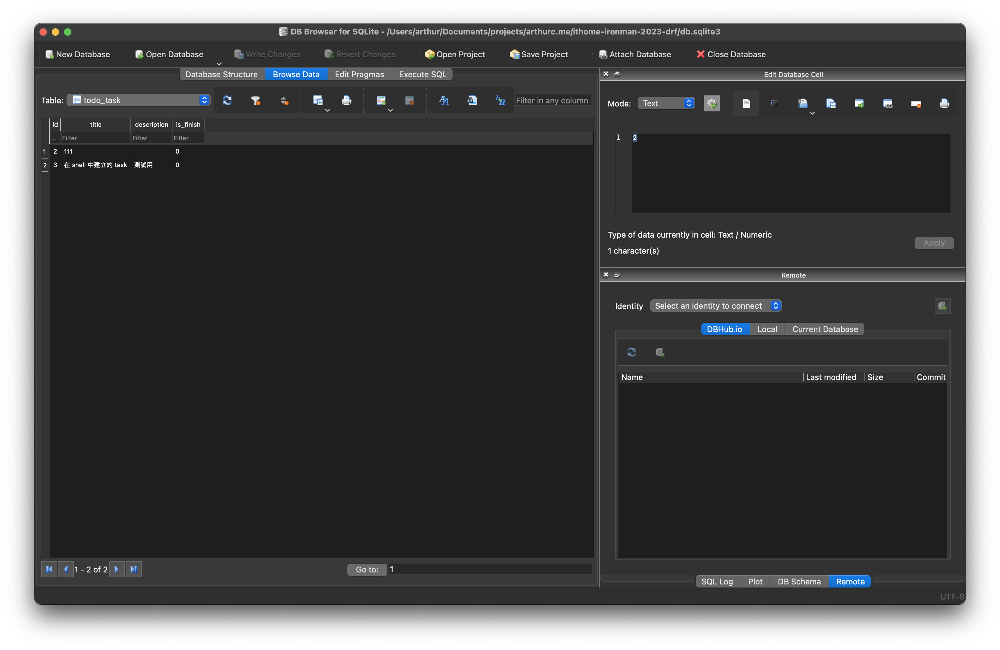

# Day08 - 資料庫的操作

## 前言

昨天我們透過 DRF 的 ViewSet 建立了第一個 API，也說明了序列化在 API 中扮演的角色，但我們跳過了一個部分也就是在設定 `queryset` 的語法。他其實就是我們前面提到的 ORM 的語法，讓我們一起探索吧！

## 設定 Django shell

為了方便練習 ORM 的語法，我們需要先進入 Django 的 shell，我們可以把他想像成 Python 互動模式的加強版，我們可以在裡面使用 Django 提供的 ORM 語法。

讓我們開啟 Django 的 shell 吧（別忘了先啟用虛擬環境）

```bash
python manage.py shell
```

大家可以看到一個類似於 Python 互動模式的畫面可以在裡面直接輸入 Python 的語法，輸入 `exit()` 可以離開互動模式。目前這個模式很棒，我們已經可以練習 ORM 語法了，但是沒有顏色看起來不是太好看，所以我們來安裝一下 `IPython` 讓我們可以有比較漂亮的互動環境（記得先離開互動模式）

```bash
poetry add --group dev ipython
```

接著我們再次重新啟動互動模式

```bash
python manage.py shell
```

這樣應該就能看到漂亮的互動模式了。

## 進行資料庫操作

現在我們已經可以進行 ORM 語法的練習了，我們在互動模式下輸入下方語法（後面的語法如果沒特別說明，都是在互動模式下輸入）

```python
from server.app.todo.models import Task
```

上面的語法是先將 Model import 進來，方便我們後續使用

### 建立

接著我們來建立資料吧

```python
Task.objects.create(title="在 shell 中建立的 task", description="測試用", is_finish=False)
```

執行完成後可以從資料庫工具中看到多出一筆新資料了



除了上面那個方法以外還可以用另一個方法建立資料

```python
task = Task(title="第二個在 shell 中建立的 task", description="測試用", is_finish=True)
task.save()
```

### 查詢

我們已經將資料塞進資料庫了，接著我們把他找查出來

```python
tasks = Task.objects.all()
```

上方這個指令跟我們昨天用的是一樣的，他的功能是把全部的資料都查詢出來，並把他放到 tasks 這個變數中，接著我們來看看怎麼樣可以拿到單筆資料

```python
tasks.first()  # 獲取第一筆
tasks.last()  # 獲取最後一筆
tasks[1]  # 獲取索引值為 1 的資料
tasks[:2]  # 獲取前 2 筆的資料（邏輯與 list 的切片相同）
```

以上就是獲取單筆或指定部分資料的方法，但是通常查詢我們不一定會希望全部都拿到，通常會需要搭配過濾的功能

```python
Task.objects.filter(is_finish=True)  # 只要已完成的任務
Task.objects.exclude(is_finish=True)  # 不要已完成的任務
```

以上可以透過 filter 獲取符合指定的資料，也可以透過 exclude 過濾掉符合條件的資料，前面提到的兩個方法都有可能會回傳多筆的資料，如果希望過濾後只回傳一筆的話可以透過下面這個方法（ID 需要看資料庫的內容進行調整，未必每次都是 1）

```python
Task.objects.get(id=1)  # 獲取 ID 為 1 的資料
```

但在使用 get 方法時要特別注意，他會限制你的搜尋結果一定要有一筆資料且只能有一筆資料。如果你希望獲取第一筆已完成的任務的話可以使用下方語法

```python
Task.objects.filter(is_finish=True).first()
```

用上方的這個語法會得到第一筆已完成的任務，如果有多筆他只會回傳第一筆，如果不存在已完成的任務則會回傳 `None`

如果想要決定資料的排序方式可以使用下方的語法

```python
Task.objects.order_by("title")
```

如果希望倒序排序的話可以使用下列語法

```python
Task.objects.order_by("-title")
```

這邊再跟大家介紹一個特別的語法

```python
Task.objects.order_by("?")
```

這是隨機排序的方法，大家可以多執行幾次會發現每次排序出來的都不太一樣。

### 修改

接著我們來看看修改，如果希望修改單筆資料的話可以使用以下方法（ID 需要看資料庫的內容進行調整，未必每次都是 1）

```python
task = Task.objects.get(id=1)  # 先獲取 ID 為 1 的任務
task.title = "修改過後的 title"  # 賦予 title 新的值
task.save()  # 將修改過後的結果存起來
```

如果我們需要修改多筆資料的話可以透過 filter 先過濾資料，再進行修改

```python
Task.objects.filter(is_finish=False).update(is_finish=True)
```

上方的語法是將所有未完成的任務修改成已完成

### 刪除

刪除與修改相同分為單筆與多筆，如果要刪除單筆的話可以透過下方的語法（ID 需要看資料庫的內容進行調整，未必每次都是 1）

```python
task = Task.objects.get(id=1)
task.delete()
```

如果要刪除多筆的話可以透過 filter 先過濾出要刪除的資料範圍再進行刪除

```python
Task.objects.filter(is_finish=True).delete()
```

上方的語法就是將所有已經完成的任務都刪除

## 總結

今天我們學習了如何使用 Django ORM 的語法進行資料的操作，其實 Django 的語法有很多今天只講了一部分，但大家不用擔心後面用到新的語法時，我會再跟大家解釋。但是如果大家有興趣更深入的研究的話可以參考下面的文件，不過我推薦大家可以等到想要用的時候再去看看文件有沒有類似的功能不需要全部背起來

- QuerySet 有哪些語法可以用：<https://docs.djangoproject.com/en/4.2/ref/models/querysets/>
- QuerySet 的 filter 有哪些查詢可以用：<https://docs.djangoproject.com/en/4.2/ref/models/querysets/#id4>
