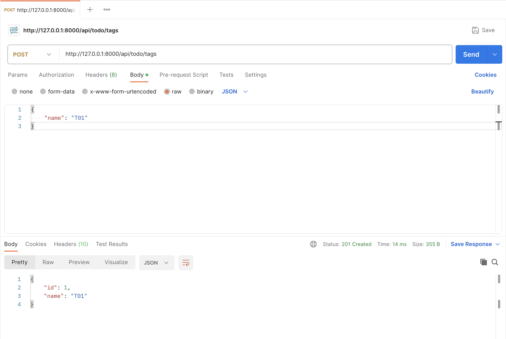
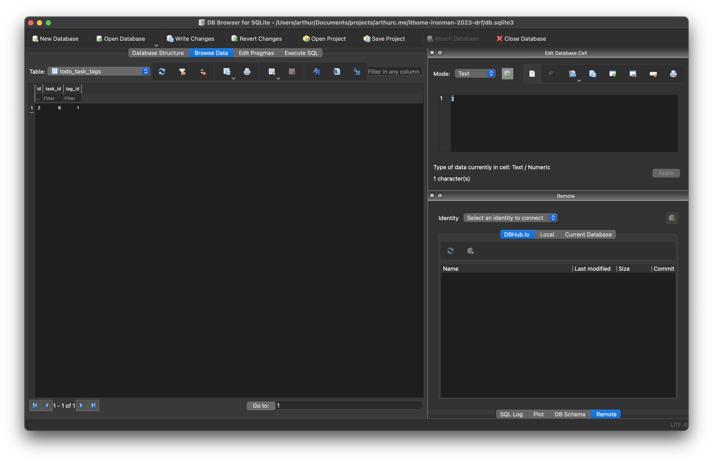

# Day09 - 資料庫關聯與 API

## 前言

昨天我們講了資料庫的操作今天我們繼續來擴充我們 TODO List 的功能，來為 Task 加上標籤

## 新增標籤 Model

首先我們要建立標籤的 Model，讓我們打開 `server/app/todo/models.py`

```diff
from django.db import models


+class Tag(models.Model):
+    name = models.CharField(max_length=255, unique=True)
+
+    def __str__(self):
+        return self.name
+
+
class Task(models.Model):
    title = models.CharField(max_length=255)
    description = models.TextField(blank=True)
    is_finish = models.BooleanField(default=False)

    def __str__(self):
        return self.title
```

讓我們在 models 這個檔案裡加入 Tag 這個資料表，這邊要注意一下我們的 Tag 要放在 Task 上面，至於是什麼原因我們後面會提到

那在 Tag 這張表中我們定義 name 這個欄位，限制最大長度為 255 同時限制名稱不能重複（unique）

再建立好 Tag 後我們需要通知資料庫要將表建立起來，但是在建立資料表前先建立遷移檔（別忘了啟動虛擬環境唷）

```bash
python manage.py makemigrations
```

建立後遷移檔案後（可以看到 `server/app/todo/migrations` 裡面出現了 `0003_tag.py` 這個檔案）就可以通知 Django 把資料表建立起來了

```bash
python manage.py migrate
```

到這邊我們就把表建立起來了。

## 建立序列化

前面我們已經將 Model 定義好了，那我們現在就來建立序列化吧，打開 `server/app/todo/serializers.py` 在檔案最下方貼入下方的內容

```python
# ...... 以上省略 ......

class TagSerializer(serializers.ModelSerializer):
    class Meta:
        model = todo_models.Tag
        fields = "__all__"
```

## 建立 View

接著我們把 ViewSet 建立起來，打開 `server/app/todo/views.py` 在檔案最下方貼入下方的內容

```python
# ...... 以上省略 ......

class TagViewSet(viewsets.ModelViewSet):
    queryset = todo_models.Tag.objects.all()
    serializer_class = todo_serializers.TagSerializer
```

## 註冊路由

接著我們來將 ViewSet 註冊進路由中，打開 `server/urls.py` 修改檔案內容將 TagViewSet 註冊進去

```diff
# ...... 以上省略 .....

router = routers.SimpleRouter(trailing_slash=False)
router.register("todo/tasks", todo_views.TaskViewSet)
+router.register("todo/tags", todo_views.TagViewSet)

urlpatterns = [

# ...... 以下省略 ......
```

今天的進度到目前為止都跟 [Day07](https://ithelp.ithome.com.tw/articles/10325224) 的差不多，只是將 Model 替換成 Tag，所以我們可以參考 Day07 的測試方法，使用 Postman 新增幾個 Tag 資料。

## 將 Tag 與 Task 關聯起來

現在我們已經將 Tag 相關的東西都先定義好了，現在我們需要將 Tag 與 Task 這兩個 Model 關聯起來，這樣我們才能儲存 Task 所擁有的標籤。

打開 `server/app/todo/models.py` 依照下方範例修改檔案內容

```diff
# ...... 以上省略 ......

class Task(models.Model):
    title = models.CharField(max_length=255)
    description = models.TextField(blank=True)
    is_finish = models.BooleanField(default=False)
+   tags = models.ManyToManyField(Tag)

    def __str__(self):
        return self.title
```

在這邊我們定義了一個欄位名稱為 `tags` 他是一個多對多的欄位，他表達了一個 Task 可以有多個 Tag，同時一個 Tag 也可以屬於多個 Task。

到這邊可以看到我們在 `ManyToManyField` 會需要指定要使用哪個 Model，所以前面在定義 Tag 時才會特別提醒大家要將 Tag Model 放到 Task 的上方。

那這邊因為我們有修改 `models.py` 的內容所以別忘了要建立遷移檔並讓 Django 將遷移檔套用到資料庫中

```bash
python manage.py makemigrations
python manage.py migrate
```

這邊說明一下，在一般使用資料庫的時候如我要表達多對多的關係，會需要使用三張表

1. Tag
2. Task
3. Task 與 Tag 對應關係

那在 Django 這邊我們定義表的時候其實只有定義兩張，是因為 Django 會很貼心的幫我們處理第三張表，我們只需要處理 Tag 與 Task 即可，但實際上資料庫中還是有第三張表存在的，大家可以打開資料庫管理工具找到表 `todo_task_tags`，那就是 Task 與 Tag 的對應關係表。

## 驗證

首先我們先將 server 跑起來

```bash
python manage.py runserver
```

再來我們可以打開 Postman，輸入網址與 HTTP Body

URL: <http://127.0.0.1:8000/api/todo/tags>

Body:

```json
{
    "name": "T01"
}
```



這邊我們建立了一個 Tag 名叫 T01，他的 ID 是 1。

後來我們建立一個新的 Task 並且將 T01 標籤指派給他

URL: <http://127.0.0.1:8000/api/todo/tasks>

Body:

```json
{
    "title": "測試任務與標籤",
    "description": "這是一個測試任務",
    "is_finish": false,
    "tags": [
        1
    ]
}
```


建立完成後，我們就已經建立了一個 Task 並且它擁有 T01 這個標籤，大家可以從資料庫管理工具看 `todo_task_tags` 這張表裡面的資料，可以發現兩者的關係已經變儲存（task 的 ID 是 6，然後 tag 的 ID 是 1）



## 總結

今天我們建立了一個 Tag 的表，並將他跟 Task 關聯起來。並且我們現在可以用 API 建立有標籤的任務了，結束前別忘了檢查一下今天的程式碼有沒有問題，並排版好喔。

```bash
ruff check --fix .
black .
pyright .
```

但目前這樣的 API 還不夠完整，我們明天繼續將他完整化吧！
