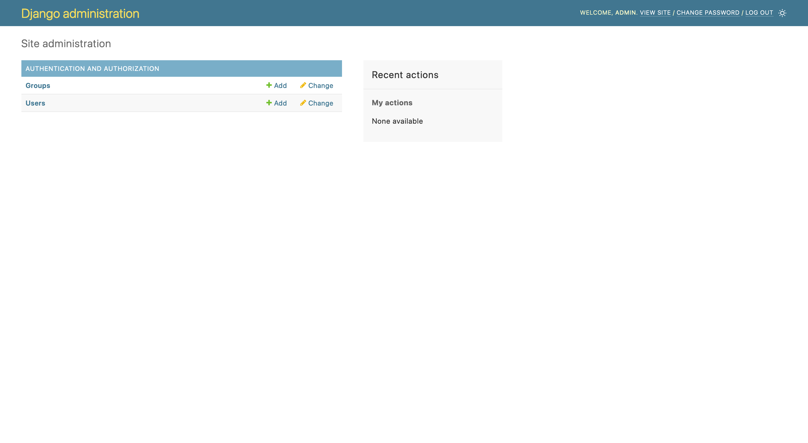
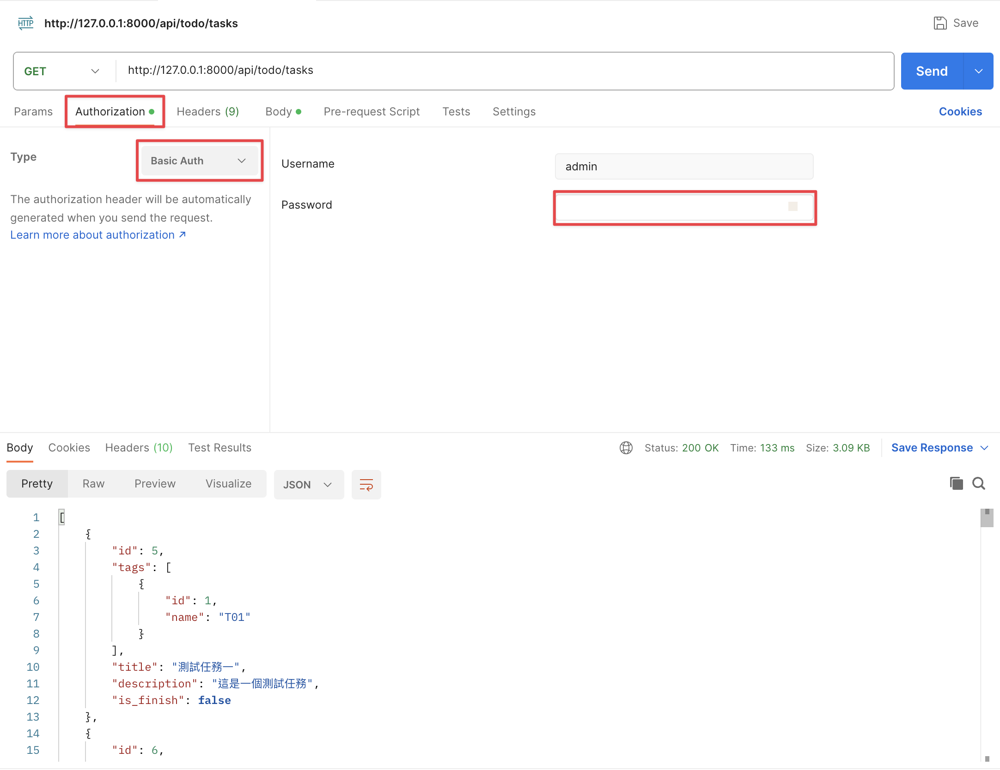

# Day13 - API 權限控管

## 前言

前面我們已經建立了幾個 API 了，但目前的狀況是大家知道網址就能呼叫，完全沒有做控管，所以今天我們要來幫 API 加上權限吧！

## 建立使用者

要幫 API 加上權限控管首先我們需要有個使用者，但目前我們一個都沒有。我們甚至連 User 的 Model 都沒有定義，不過大家不用擔心，Django 內建有權限相關的東西（之前我們 migrate 時所產生出的那堆表中 `auth_` 開頭的就是權限相關的），所以現在我們不需要額外定義 User 相關的東西了（這就是使用框架的好處），我們直接新增帳號就好了。

讓我們在終端機輸入下方指令（記得啟動虛擬環境）

```bash
python manage.py createsuperuser
```

接著依照他的指示輸入帳號密碼等等的資訊（如下）

```plaintext
Username (leave blank to use 'user'): admin
Email address: admin@example.com
Password:
Password (again):
This password is too short. It must contain at least 8 characters.
This password is too common.
This password is entirely numeric.
Bypass password validation and create user anyway? [y/N]: y
Superuser created successfully.
```

在輸入完第二次密碼時，如果你的密碼太簡單才會跳出下方這三行

```plaintext
This password is too short. It must contain at least 8 characters.
This password is too common.
This password is entirely numeric.
Bypass password validation and create user anyway? [y/N]: y
```

可以按下 `y` 跳過密碼複雜度驗證，只要看到 `Superuser created successfully.` 就代表新增成功了。

## 試試剛建立好的使用者

現在我們已經將第一個帳號建立好了，使用 `createsuperuser` 這個指令建立出來的使用者都是「超級使用者」他擁有最大的權限，所以我們可以在 Admin 系統中登入看看，所謂的 Admin 系統就是 Django 提供的管理畫面，詳細的部分我們後面會提到，現在讓我們先登入看看吧！

開啟 Django 的 server

```bash
python manage.py runserver
```

接著在瀏覽器中打開 <http://127.0.0.1:8000/admin> 現在你應該會看到一個登入的畫面，試著登入看看你剛剛建立好的使用者，如果登入成功就代表一切都正常運作了。



## 在 API 上加上權限

現在我們已經透過 Admin 確定我們建立的使用者真的可以使用了，現在讓我們在 API 上指定要登入的使用者才能使用我們的 API 吧。

打開 `server/app/todo/views.py` 根據下方的說明修改檔案

```diff
-from rest_framework import decorators, response, viewsets
+from rest_framework import authentication, decorators, permissions, response, viewsets

from server.app.todo import models as todo_models
from server.app.todo import serializers as todo_serializers


class TaskViewSet(viewsets.ModelViewSet):
    queryset = todo_models.Task.objects.all()
    serializer_class = todo_serializers.TaskSerializer

+   authentication_classes = (authentication.BasicAuthentication,)
+   permission_classes = (permissions.IsAuthenticated,)

    def get_serializer_class(self):
        if self.action == "create":
            return todo_serializers.TaskCreateSerializer

        return super().get_serializer_class()

    @decorators.action(methods=["patch"], detail=True)
    def status(self, request, pk):
        task = self.get_object()

        serializer = self.get_serializer(
            task,
            data={"is_finish": not task.is_finish},
            partial=True,
        )
        serializer.is_valid(raise_exception=True)
        serializer.save()

        return response.Response(serializer.data)

# ......  以下省略 ......
```

上面我們設定了兩個東西

1. authentication_classes: 這個是指定現在的 ViewSet 可以使用的驗證模式，驗證的模式有分很多種這次我們使用的是 [HTTP Basic](https://zh.wikipedia.org/zh-tw/HTTP%E5%9F%BA%E6%9C%AC%E8%AE%A4%E8%AF%81)，後面我們會再介紹其他種。
2. permission_classes: 這個是指定現在的 ViewSet 需要哪些權限才能使用，目前我們設定的是 `IsAuthenticated` 代表要經過驗證的使用者才能使用。權限的種類一樣有很多，我們後面再慢慢介紹。

現在大家可以試試看用之前的方法請求 Task 的 API 時會得到如下的錯誤

```json
{
    "detail": "Authentication credentials were not provided."
}
```

代表我們並沒有提供身份驗證相關的資訊，這時候我們只需要在 Postman 中先選擇 Authorization 接著選擇 Type 為 Basic Auth 再輸入帳號密碼，重新請求後就可以看到正常回應了。



## 一次設定全部的 ViewSet

現在我們已經在 TaskViewSet 中設定好權限跟驗證了，但這時候我們試試看呼叫 Tag 的 API 你會發現沒有提供身份驗證還是可以呼叫，因為我們只在 TaskViewSet 設定了相關的東西，但我們不可能一個一個設定，這樣如果很多 ViewSet 或是要修改的時候會很辛苦。

所以 DRF 有提供一個方法可以一次把所有的 ViewSet 都設定好，讓我們打開 `server/settings.py` 並依照下方的提示修改（可以直接貼在檔案最下方）

```diff
# ...... 以上省略

# Default primary key field type
# https://docs.djangoproject.com/en/4.2/ref/settings/#default-auto-field

DEFAULT_AUTO_FIELD = "django.db.models.BigAutoField"


+# DRF settings
+
+REST_FRAMEWORK = {
+    "DEFAULT_AUTHENTICATION_CLASSES": [
+        "rest_framework.authentication.BasicAuthentication",
+    ],
+    "DEFAULT_PERMISSION_CLASSES": [
+        "rest_framework.permissions.IsAuthenticated",
+    ],
+}
```

現在可以試試看呼叫其他 API 應該會發現所有的 API 都已經加上權限驗證了。

## 總結

今天我們已經將權限設定好了。結束前別忘了檢查一下今天的程式碼有沒有問題，並排版好喔。

```bash
ruff check --fix .
black .
pyright .
```

明天我們會先介紹一下 Admin 系統，這個是 Django 中一個很好用的功能，讓我們一起期待一下吧！
