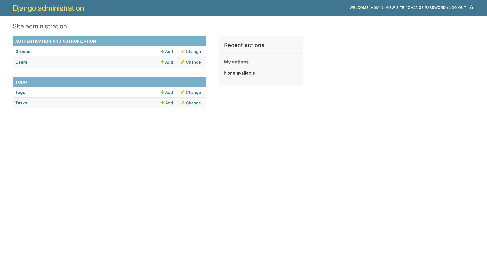
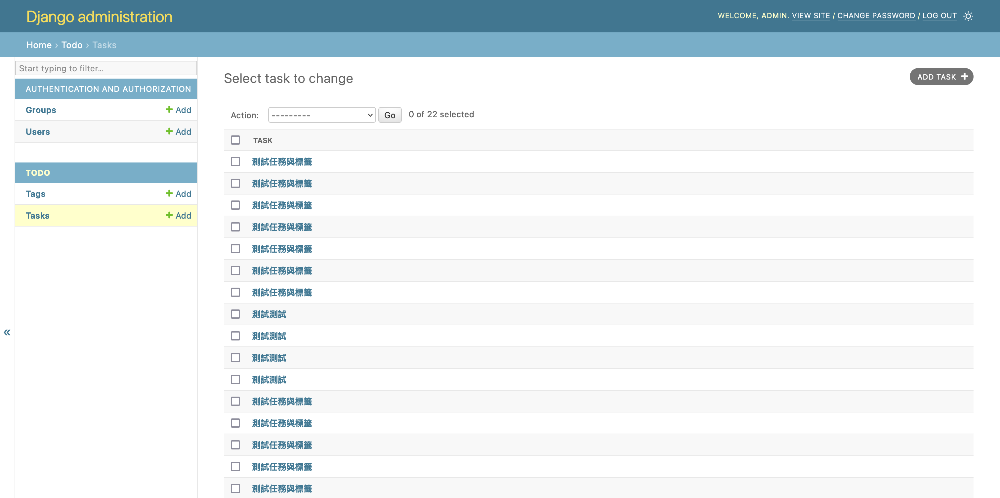
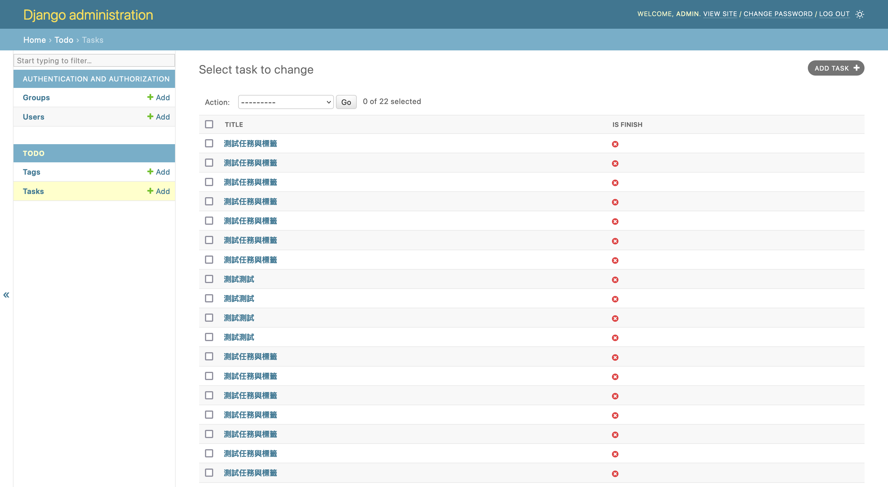
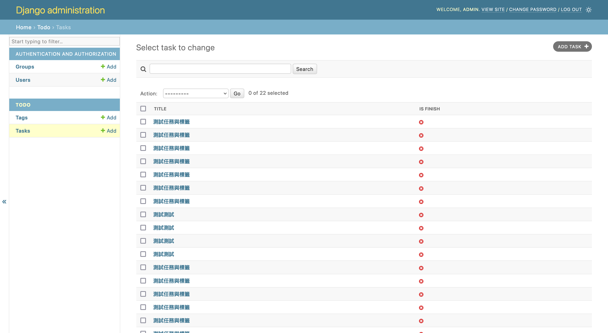
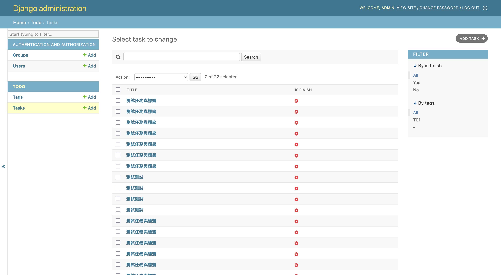
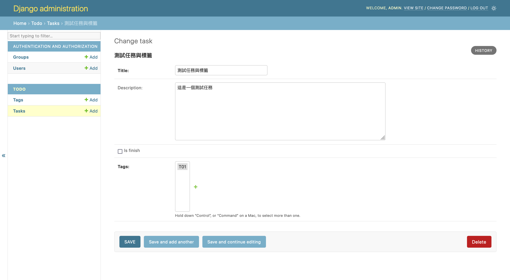
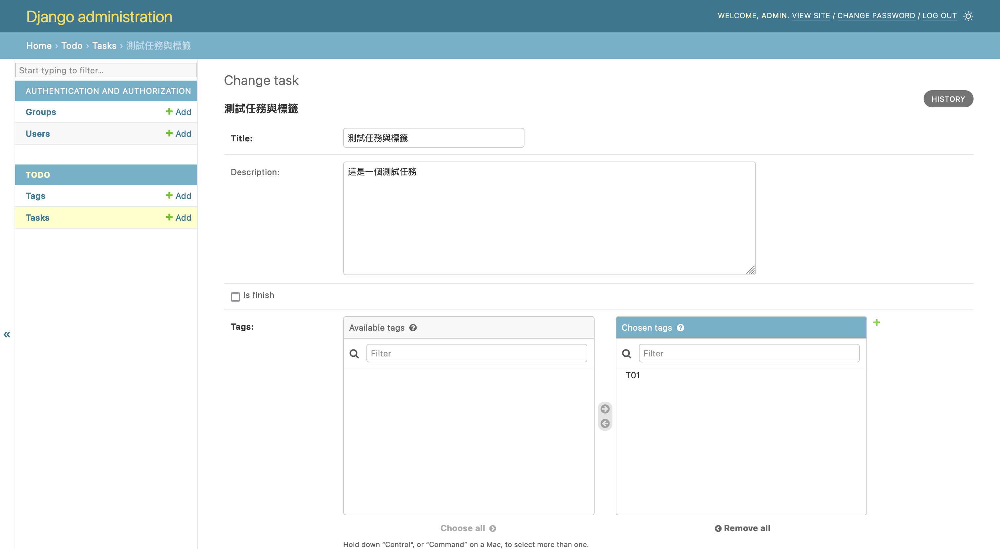
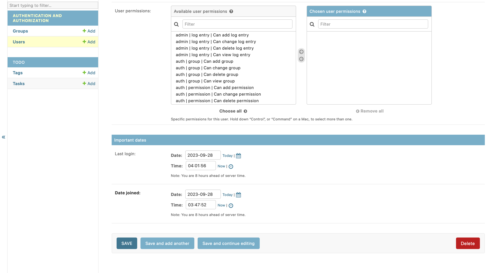
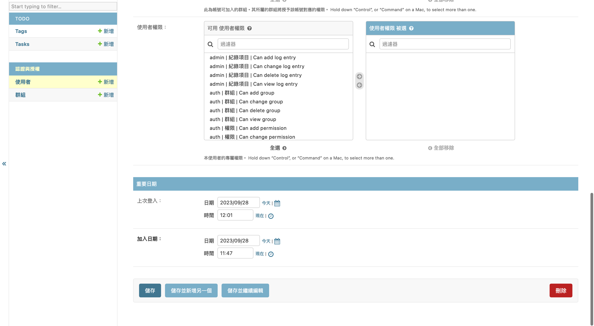

# Day14 - Admin 系統介紹

## 前言

昨天我們已經利用了 Django 內建的權限系統，讓我們的 API 多了權限控管的功能。同時我們利用了內建的 Admin 系統測試我們建立好的帳號是否能正常登入，但我們並沒有詳細的介紹 Admin 系統，今天就讓我們一起探索一下吧！

## 什麼是 Admin 系統

Admin 系統是 Django 內建的後台管理，他可以讓我們將自己建立的 Model 放進去，讓我們能有簡易的增刪改查可以使用並進行一定程度的客製化。這時候大家可能會有疑惑那這樣我們還需要自己寫系統嗎？其實還是需要的因為 Admin 雖然能提供一些基礎的功能，但還是存在一些限制，如果你只需要一些簡易的功能當然可以直接使用 Admin 系統，但如果你需要大量的客製化，那自己寫獨立的系統會是更方便且更好維護的。

例如我們需要有一個 API 可以提供前端串接，但是也需要一個類似於資料庫管理介面的後台，方便管理人員管理資料，那我們就可以用 Admin 搭建後台系統，讓前端工程師專注的完成前台（面對一般使用者的畫面）就好了。

## 將自己的 Model 註冊到 Admin 中

那說了那麼多讓我們來把我們前面定義的 Task 以及 Tag Model 註冊到 Admin 中吧。

首先我們先開啟 server（記得啟動虛擬環境）

```bash
python manage.py runserver
```

接著訪問 <http://127.0.0.1:8000/admin> 你應該會看到昨天登入成功的畫面，那裡面應該已經有兩張表了，分別為使用者以及群組，那是 Django 內建的表。

現在我們打開 `server/app/todo/admin.py` 這個檔案並將下方的程式碼貼到檔案中（覆蓋裡面的所有內容）

```python
from django.contrib import admin

from server.app.todo import models as todo_models


@admin.register(todo_models.Task)
class TaskAdmin(admin.ModelAdmin):
    pass


@admin.register(todo_models.Tag)
class TagAdmin(admin.ModelAdmin):
    pass
```

這時候你可以重新整理 Admin 畫面，你應該會發現畫面中多出了 Task 以及 Tag 的 Model，你可以點進去，應該會發現增刪改查相關的功能都已經可以使用了。



## 客製化 Admin 畫面

讓我們先看看 Task 列表的畫面



你會發現現在列表中只有一個欄位名為 `title` 其實目前這個欄位所顯示的內容就是之前我們在 Model 中定義的 `__str__` 方法所回傳的內容，因為我們之前回傳的是 title 所以目前是顯示標題，如果大家有興趣可以修改一下 `__str__` 所回傳的內容，重新整理後應該會看到畫面上顯示的值有所改變。

接著我們來介紹幾個客製化 Admin 的畫面的功能，假設我希望列表上顯示多幾個欄位我可以這樣修改 `server/app/todo/admin.py`

```diff
from django.contrib import admin

from server.app.todo import models as todo_models


@admin.register(todo_models.Task)
class TaskAdmin(admin.ModelAdmin):
-   pass
+   list_display = ("title", "is_finish")


@admin.register(todo_models.Tag)
class TagAdmin(admin.ModelAdmin):
    pass
```

這樣是設定列表要顯示 title 與 is_finish 兩個欄位



接著我們來加上搜尋欄位

```diff
from django.contrib import admin

from server.app.todo import models as todo_models


@admin.register(todo_models.Task)
class TaskAdmin(admin.ModelAdmin):
    list_display = ("title", "is_finish")
+   search_fields = ("title", "description")


@admin.register(todo_models.Tag)
class TagAdmin(admin.ModelAdmin):
    pass
```

這樣就是在 Task 的列表中加上搜尋欄位，當我們在搜尋框輸入文字時，他會到 title 與 description 欄位中尋找是否有符合的資料



接著讓我們來為 Task 列表加上篩選功能

```diff
from django.contrib import admin

from server.app.todo import models as todo_models


@admin.register(todo_models.Task)
class TaskAdmin(admin.ModelAdmin):
    list_display = ("title", "is_finish")
+   list_filter = ("is_finish", "tags")
    search_fields = ("title", "description")


@admin.register(todo_models.Tag)
class TagAdmin(admin.ModelAdmin):
    pass
```

現在應該會看到畫面的右邊出現篩選的功能



現在列表相關的設定暫時先調整到這樣，我們接著調整下詳細資料的東西，目前我們的 Tag 選取畫面長得像這樣



功能都正常但其實不太好區分 tag 是否有被選取所以讓我們調整下，讓他變得更好看一些

```diff
from django.contrib import admin

from server.app.todo import models as todo_models


@admin.register(todo_models.Task)
class TaskAdmin(admin.ModelAdmin):
    list_display = ("title", "is_finish")
    list_filter = ("is_finish", "tags")
    search_fields = ("title", "description")
+   filter_horizontal = ("tags",)


@admin.register(todo_models.Tag)
class TagAdmin(admin.ModelAdmin):
    pass
```

現在應該可以看到畫面中選取 tag 的變成現在這個樣子



這樣就能很明白的看出來 tag 是否被選取了

## 語系與時區

大家使用到現在應該有發現我們現在看到的 Admin 系統都是英文的，且如果你打開 user 的詳細資料頁面，捲動到最下方看到時間相關的資料，應該會發現與我們現在所以在時區不同



這時候如果想要調整就可以調整 `server/settings.py` 裡面的設定

```diff
# ...... 以上省略 ......

-LANGUAGE_CODE = "en-us"
+LANGUAGE_CODE = "zh-hant"

-TIME_ZONE = "UTC"
+TIME_ZONE = "Asia/Taipei"

# ...... 以下省略 ......
```

調整完這兩個畫面應該就可以看到介面變為中文，且時間變成台北的時區了



## 總結

今天我們將自己的 Model 註冊進 Admin 系統，並透過幾行設定，就進行簡單的客製化，這就是 Admin 系統的方便之處，我們可以簡單地完成一些後台管理需要的功能，今天我們只介紹了一些設定，但因為本系列文章的重點會放在 API 的開發所以後面不會特別深入的探索 Admin 相關的東西，大家如果有興趣可以參考這個[文件](https://docs.djangoproject.com/en/4.2/ref/contrib/admin/)

結束前別忘了檢查一下今天的程式碼有沒有問題，並排版好喔。

```bash
ruff check --fix .
black .
pyright .
```

明天我們就會繼續開發我們的任務清單了～
