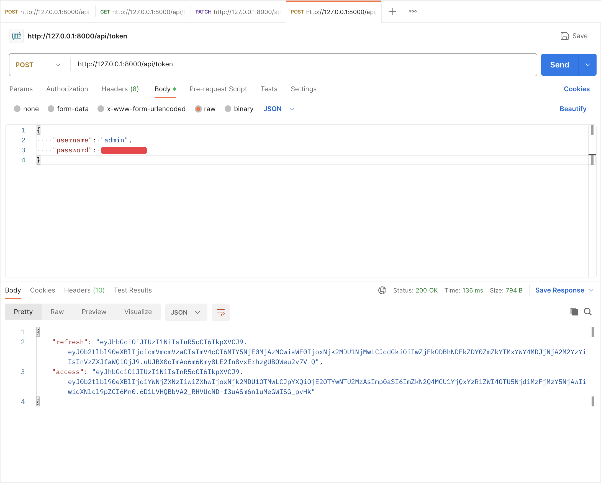
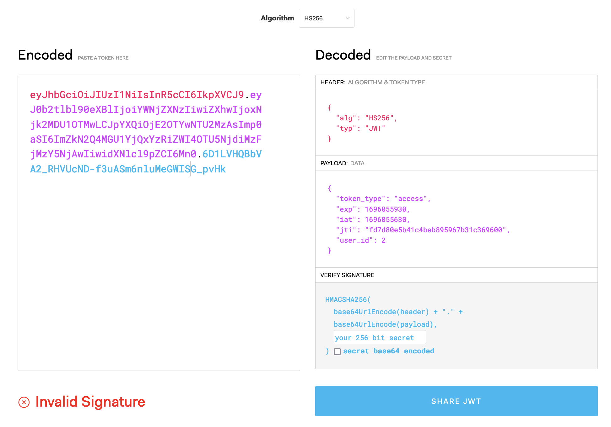
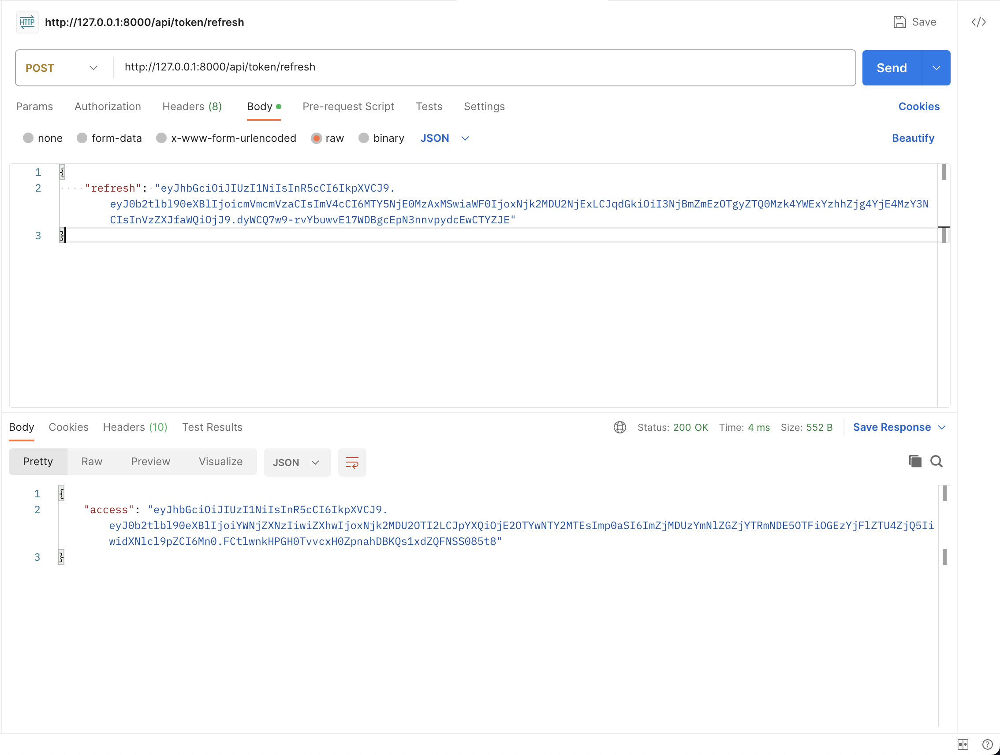
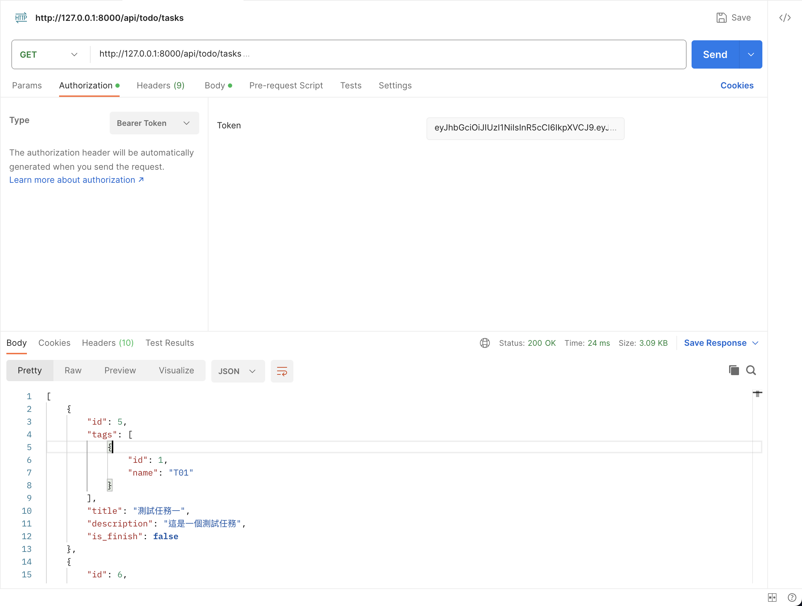

# Day15 - JWT 驗證

## 前言

在 Day13 時我們介紹了 API 權限驗證，那時候我們用的身份驗證方法是 HTTP Basic 方法，但其實這個方法不常被使用在一般的驗證中，因為這樣必須每個請求都傳送使用者的帳號以及密碼，所以後來漸漸衍生出使用 Token 進行驗證，也就是先驗證使用者帳號以及密碼後給使用者個 Token（可以想像成一段亂碼），而這個 Token 可以代表使用者，當使用者請求 API 時只要攜帶這個 Token 那 API 就能知道實際上請求的使用者是誰。但是這樣反而會產生一個缺點，就是我們每次拿到 Token 後就必須要去資料庫中尋找這個 Token 是否合法，再獲得這個 Token 所對應的使用者，所以漸漸地又衍生出一個名為 JWT 的驗證方法。

## 什麼是 JWT

JWT 其實是 JSON Web Token 的縮寫，說穿了他其實也是 Token 驗證的一種，他透過 `.` 符號將 Token 區隔成三個部分

- Header：包含了該令牌的類型和使用的加密算法。
- Payload：包含了有關 Token 的訊息，例如屬於誰還有 Token 何時過期等等。
- Signature：用於驗證令牌的完整性，確定 Token 是合法的。

那為什麼他會逐漸取代傳統的 Token 驗證呢？主要是因為他可以不用訪問資料庫就判斷 Token 的合法性，當 Token 合法就代表 Payload 裡面的內容是合法的，這樣可以避免每次都要詢問資料庫來判斷 Token 是否合法。同時如果多個系統使用同個金鑰加密 Token，或是使用非對稱加密的方式達到跨系統的驗證，這邊我只是簡單的說明了一下 JWT 相關的概念，如果大家想深入研究可以參考官方[文件](https://jwt.io/introduction)。

## 在 DRF 中加入 JWT 驗證

### 安裝套件

首先我們需要時做 JWT 驗證需要透過套件 [djangorestframework-simplejwt](https://github.com/jazzband/djangorestframework-simplejwt) 來幫著我們，所以我們先安裝他

```bash
poetry add djangorestframework-simplejwt
```

而我們也需要將這個 APP 加入 `server/settings.py` 中

```diff
# ...... 以上省略 ......

INSTALLED_APPS = [
    "django.contrib.admin",
    "django.contrib.auth",
    "django.contrib.contenttypes",
    "django.contrib.sessions",
    "django.contrib.messages",
    "django.contrib.staticfiles",
    "rest_framework",
+   "rest_framework_simplejwt",
    "server.app.common",
    "server.app.todo",
]

# ...... 以下省略 ......
```

### 產生 JWT

接下來我們利用他內建的 View 來讓我們實現登入的功能，打開 `server/urls.py` 並修改檔案內容

```diff
# ...... 以上省略 ......

from django.contrib import admin
from django.urls import include, path
from rest_framework import routers
+from rest_framework_simplejwt import views as jwt_views

from server.app.common import views as common_views
from server.app.todo import views as todo_views

router = routers.SimpleRouter(trailing_slash=False)
router.register("todo/tasks", todo_views.TaskViewSet)
router.register("todo/tags", todo_views.TagViewSet)

urlpatterns = [
    path("admin/", admin.site.urls),
    path("health", common_views.HealthView.as_view()),
+   path("api/token", jwt_views.TokenObtainPairView.as_view()),
    path("api/", include(router.urls)),
]
```

這時候大家打開 Postman 並試著使用 POST 方法呼叫 <http://127.0.0.1:8000/api/token>（記得啟動虛擬環境並開啟 server 喔）

HTTP Body 如下：

```json
{
    "username": "admin",
    "password": "0"
}
```



這時候可以看到 Token 建立完成，而 API 回傳了兩個東西給我們，分別是 access 與 refresh 這兩個 Token，access 是用於訪問 API 時的身份認證，而 refresh 是用於當 access 過期時可以獲得新的 access，通常我們會將 access 的時間設定的比較短，而 refresh 設定的比較長。

如果想看看 Token 的內容可以將 access 的字串貼到 <https://jwt.io> 上看看裡面的內容



可以看到左邊是我們的 token 而右邊是我們 token 的內容裡面包含了 token 效期與屬於哪個使用者，至於會看到紅色的 Invalid signature 訊息是因為我們並沒有提供加密用的金鑰給網站的緣故，Django 這邊預設是使用在 `server/settings.py` 中的 `SECRET_KEY` 當作加密金鑰。

### Refresh JWT

現在我們已經可以讓使用者透過帳號密碼獲取 Token 了，前面有提到當 access 過期時我們需要讓他們有辦法更新 Token，所以現在我們要來加上更新 Token 的 View

打開 `server/urls.py` 並修改

```diff
# ...... 以上省略 ......

urlpatterns = [
    path("admin/", admin.site.urls),
    path("health", common_views.HealthView.as_view()),
    path("api/token", jwt_views.TokenObtainPairView.as_view()),
+   path("api/token/refresh", jwt_views.TokenRefreshView.as_view()),
    path("api/", include(router.urls)),
]
```

這時候再打開 Postman 並使用使用 HTTP 方法是 POST 呼叫 <http://127.0.0.1:8000/api/token/refresh> 來使用 refresh token 獲得新的 access token，HTTP Body 如下



### 使用 JWT 作為身份驗證

現在我們已經可以取得以及更新 JWT 了，現在讓我們來將 View 改為使用 JWT 驗證吧

打開 `server/settings.py` 並修改

```diff
# ...... 以上省略 ......

REST_FRAMEWORK = {
    "DEFAULT_AUTHENTICATION_CLASSES": [
-       "rest_framework.authentication.BasicAuthentication",
+       "rest_framework_simplejwt.authentication.JWTAuthentication",
    ],
    "DEFAULT_PERMISSION_CLASSES": [
        "rest_framework.permissions.IsAuthenticated",
    ],
}
```

這樣我們就將 Basic 驗證換成 JWT 驗證了，其實 DRF 接受多個驗證方式並存，代表我們接受 `DEFAULT_AUTHENTICATION_CLASSES` 這個 list 中設定的驗證方式的任何一個，但為了確定我們 JWT 有設定成功我們將 Basic 移除。

接著別忘了我們之前有在 TaskViewSet 中設定驗證方式以及權限，我們現在將它移除，讓他統一使用設定中指定的方式，打開 `server/app/todo/views.py` 並修改

```diff
-from rest_framework import authentication, decorators, permissions, response, viewsets
+from rest_framework import decorators, response, viewsets

from server.app.todo import models as todo_models
from server.app.todo import serializers as todo_serializers


class TaskViewSet(viewsets.ModelViewSet):
    queryset = todo_models.Task.objects.all()
    serializer_class = todo_serializers.TaskSerializer
-
-    authentication_classes = (authentication.BasicAuthentication,)
-    permission_classes = (permissions.IsAuthenticated,)

    def get_serializer_class(self):
        if self.action == "create":
            return todo_serializers.TaskCreateSerializer

        return super().get_serializer_class()

# ...... 以下省略 ......
```

現在我們可以試試看是否可以使用 JWT 作為身份驗證了，在 Postman 中使用 GET 方法請求 <http://127.0.0.1:8000/api/todo/tasks>

並選擇 `Authorization` 分頁並將 type 選為 `Bearer Token` 再將 access 貼入，應該就能請求成功了（如果出現過期相關的訊息請重新呼叫 `api/token/refresh` 或是 `/api/token` 產生新的 access）



### 其他設定

前面提到 refresh 與 access 兩個 token 都有時效性，那我們要如何調整這裡過 token 的時效呢？

打開 `server/settings.py` 並修改

```diff
"""
Django settings for server project.

Generated by 'django-admin startproject' using Django 4.2.5.

For more information on this file, see
https://docs.djangoproject.com/en/4.2/topics/settings/

For the full list of settings and their values, see
https://docs.djangoproject.com/en/4.2/ref/settings/
"""

+import datetime
from pathlib import Path

# Build paths inside the project like this: BASE_DIR / 'subdir'.
BASE_DIR = Path(__file__).resolve().parent.parent

# ...... 中間省略 ......

REST_FRAMEWORK = {
    "DEFAULT_AUTHENTICATION_CLASSES": [
        "rest_framework_simplejwt.authentication.JWTAuthentication",
    ],
    "DEFAULT_PERMISSION_CLASSES": [
        "rest_framework.permissions.IsAuthenticated",
    ],
}

+SIMPLE_JWT = {
+   "ACCESS_TOKEN_LIFETIME": datetime.timedelta(minutes=5),
+   "REFRESH_TOKEN_LIFETIME": datetime.timedelta(days=1),
+   "ROTATE_REFRESH_TOKENS": True,
+}
```

我們新增的這三個設定用意分別如下：

- ACCESS_TOKEN_LIFETIME: 代表的是 access 的可使用時間，這邊設定為五分鐘
- REFRESH_TOKEN_LIFETIME: 代表的是 refresh 的可使用時間，這邊設定為一天
- ROTATE_REFRESH_TOKENS: 的意思是當我更新 access 時順便更新 refresh，設定為 True 的原因是因為我們前面在呼叫 `/api/token/refresh` 這個 API 時只會更新 access 那當使用者一直使用系統，到 refresh 過期的那個時間（這邊是一天）就會無法繼續使用（因為 refresh 已過期）必須重新登入，這個設定被設定成 True 後當我們更新 access 時 API 會多回傳一個新的 refresh 給我們，這樣使用者若有持續在使用它就能一直使用不被登出，但如果停止使用當 refresh 過其實依然需要重新登入。

## 總結

今天介紹了 JWT 並將我們的 API 都設定成使用 JWT 驗證了。結束前別忘了檢查一下今天的程式碼有沒有問題，並排版好喔。

```bash
ruff check --fix .
black .
pyright .
```

明天我們會學習如何製作 API 的文件，讓我們一起期待一下吧。
