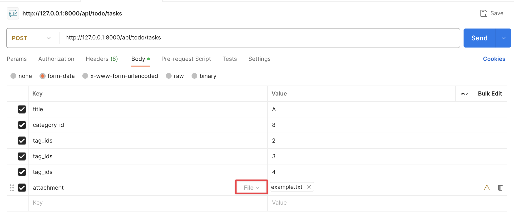
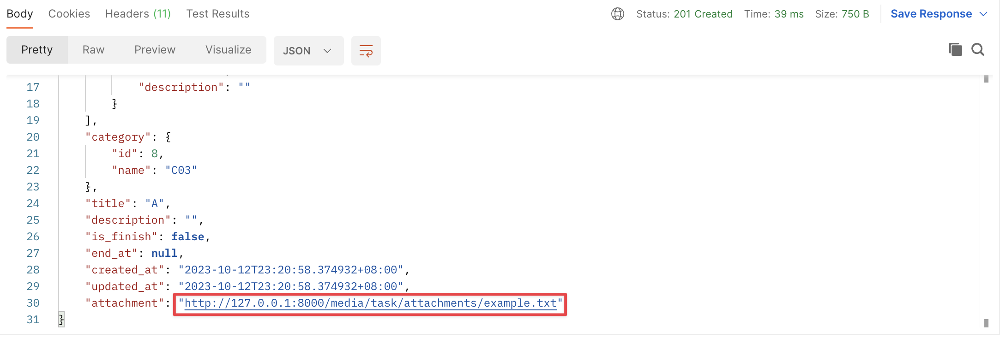

# Day27 - 檔案上傳

## 前言

今天我們來做一下檔案上傳的功能，畢竟我們的任務除了說明以外最好還可以有附件的功能。

## 修改 Model

讓我們編輯 `server/app/todo/models.py` 檔案

```diff
# ...... 以上省略 ......

class Task(models.Model):
    title = models.CharField(max_length=255)
    description = models.TextField(blank=True)
    is_finish = models.BooleanField(default=False)
    tags = models.ManyToManyField(Tag)
    end_at = models.DateTimeField(null=True, blank=True)
    created_at = model_utils.CreatedAtField()
    updated_at = model_utils.UpdatedAtField()
    category = models.ForeignKey(Category, on_delete=models.PROTECT)
+   attachment = models.FileField(blank=True, upload_to="task/attachments/")

    def __str__(self):
        return self.title
```

這邊我們新增了一個欄位名為 attachment 他是選填（blank）的，並且我們會將檔案上傳到 `task/attachments/` 資料夾裡面，Django 會負責建立這個資料夾我們暫時不需要擔心。同時我們也不必擔心檔名重複問題 Django 一樣會處理他，我們後面會示範。

P.S. FileField 的 upload_to 除了可以放文字以外還可以放一個 function，你可以透過物件動態的產生路徑，但有一點要特別注意如果你的 id 使用的是自動編號，因為還沒存入資料庫中所以會拿不到 id 的值，在使用時要特別注意，詳細的部分可以參考[文件](https://docs.djangoproject.com/en/4.2/ref/models/fields/#django.db.models.FileField.upload_to)

現在讓我們產生遷移檔並套用到資料庫（記得啟用虛擬環境）

```bash
python manage.py makemigrations
python manage.py migrate
```

## 設定檔案網址與資料夾

接著我們需要設定一下檔案上傳後的資料夾，我們不可能讓他散落在專案中。同時我們也需要設定上傳資料的網址，這樣當使用者需要這個檔案時才能透過網址存取。讓我們編輯 `server/settings.py` 檔案

```diff
# ...... 以上省略 ......

# Static files (CSS, JavaScript, Images)
# https://docs.djangoproject.com/en/4.2/howto/static-files/

STATIC_URL = "static/"

+MEDIA_URL = "media/"
+
+MEDIA_ROOT = BASE_DIR / "media"
+
# Default primary key field type
# https://docs.djangoproject.com/en/4.2/ref/settings/#default-auto-field

DEFAULT_AUTO_FIELD = "django.db.models.BigAutoField"

# ...... 以下省略 ......
```

上方的設定 MEDIA_URL 代表的是等等我們要存取檔案的時候需要使用的網址前綴，例如我們上傳了一個任務時我們就可以使用 `http://127.0.0.1:8000/media/path/to/file` 這個網址來存取他

另外上方的 MEDIA_ROOT 代表的是所有檔案要被放在哪個資料夾中，像是任務中我們設定要上傳（upload_to）到 `task/attachments/` 這個資料夾，所以最後檔案會被存放在 BASE_DIR（當前專案目錄）下的 `media/task/attachments/` 資料夾中。

## 測試

像在讓我們來使用 Postman 上傳一下檔案，設定方式如下圖（別忘了啟動 server）



這邊我們使用了 POST 方法請求 <http://127.0.0.1:8000/api/todo/tasks>

唯一的不同是我們這邊的 Body 不再使用 JSON 而改使用 `form-data` 原因是因為之前的 JSON 傳輸方法不支援檔案的傳輸。

因為 form-data 是使用 key value 對應的方式，所以要表達多個標籤時只需要重複的設定 key 即可，如圖中的 `tag_ids` 出現多次，代表此任務使用這些標籤。

在 Postman 介面中預設 value 的型態是文字，如果希望傳輸檔案，要將滑鼠移到 key 文字旁邊，點選下拉將型態改為 file，如圖中紅色框。

現在大家可以按下送出，應該會發現專案資料夾中的 `media/task/attachments` 資料夾下應該會出現你剛剛上傳的檔案。大家也可以重複的上傳檔案，你應該會發現 Django 會自動的修改檔案名稱避免重複，例如我第一次上傳 example.txt 他會存成 `media/task/attachments/example.txt`，如果我再建立一個任務附件名稱也是 example.txt 當 Django 發現資料夾中已經有 example.txt 時他會將檔案存成 `media/task/attachments/example_zdgmyWb.txt`（檔名不一定會與我的範例完全相同），這樣就避免了檔案覆蓋的問題。

## 取得上傳的檔案

現在我們已經將檔案上傳了，那我們試著取得他。大家可以看一下我們剛剛建立的任務，應該會看到 attachment 欄位是一個網址。



我們將這個網址貼到瀏覽器中，應該會發現出現 404 畫面，無法獲取檔案。會這樣是因為我們並沒有對應的網址設定，讓我們編輯 `server/urls.py` 檔案

```diff
# ...... 以上省略 ......

"""
+from django.conf import settings
+from django.conf.urls.static import static
from django.contrib import admin
from django.urls import include, path
from drf_spectacular import views as doc_views
from rest_framework import routers
from rest_framework_simplejwt import views as jwt_views

from server.app.common import views as common_views
from server.app.todo import views as todo_views

router = routers.SimpleRouter(trailing_slash=False)
router.register("todo/tasks", todo_views.TaskViewSet)
router.register("todo/tags", todo_views.TagViewSet)
router.register("todo/categories", todo_views.CategoryViewSet)

urlpatterns = [
    path("admin/", admin.site.urls),
    path("health", common_views.HealthView.as_view()),
    path("api/token", jwt_views.TokenObtainPairView.as_view()),
    path("api/token/refresh", jwt_views.TokenRefreshView.as_view()),
    path("api/schema.json", doc_views.SpectacularJSONAPIView.as_view(), name="schema"),
    path("api/swagger/", doc_views.SpectacularSwaggerView.as_view()),
    path("api/redoc/", doc_views.SpectacularRedocView.as_view()),
    path("api/", include(router.urls)),
-]
+] + static(settings.MEDIA_URL, document_root=settings.MEDIA_ROOT)
```

這邊是告訴 Django 當我們訪問 MEDIA_URL 設定的 URL 時去 MEDIA_ROOT 中尋找檔案。

現在我們重新整理一下瀏覽器，應該就可以獲取檔案了。

P.S. 這邊要特別注意一下我們現在設定的 media 網址設定只會在開發模式下產生效果，我們先知道這件事情就好了，後面部署時再來處理他。

## 總結

今天我們學習了怎麼上傳檔案，讓任務有了附件功能。

結束前別忘了檢查一下今天的程式碼有沒有問題，並排版好喔。

```bash
ruff check --fix .
black .
pyright .
```

今天的內容就到這邊了，讓我們期待明天的內容吧。
